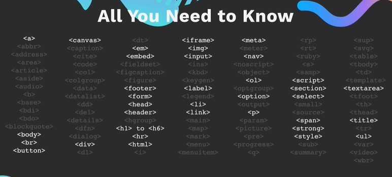
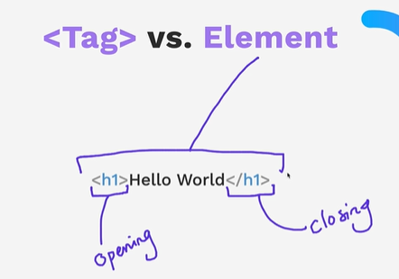
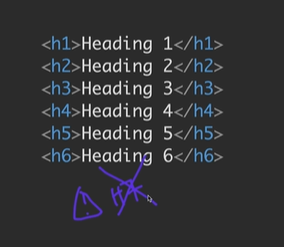
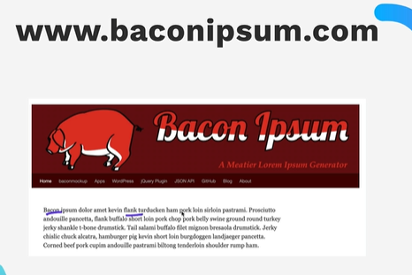
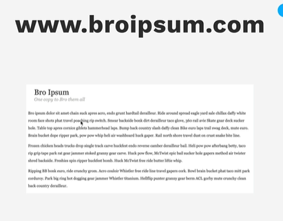
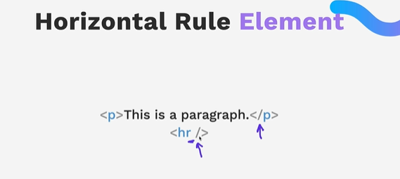
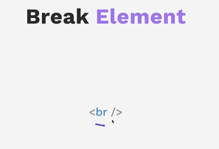
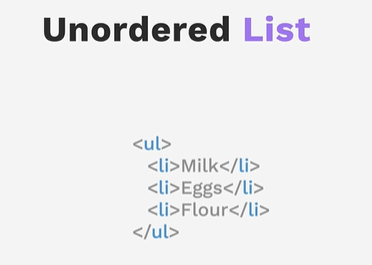
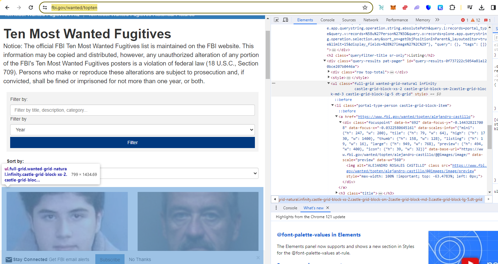

# WebDevUdemy
Web dev Udemy practice


## Section 1- Front-end Web development


1 - What you will get in this course

2-3-4 download & software install

Course syllabus in Section 1 folder - 2023+Web+Dev+Syllabus.pdf

12+Rules+to+Learn+to+Code+[2nd+Edition]+2022.pdf

Visual code Extensions

- Live preview 
- Prettier
- vscode-icons


### 5. How does Internet Actually work?

#### Submarine cables map

Under ocean cables 

https://www.submarinecablemap.com/

ISP , dns server , 

web server , client 


### 6. How does Websites Actually work?


3 types of files.


Prank your friends ! 

Play & change text ! 

Aria-label - 6:11 


#### Inspect 


### Done

my note to say i am done.


## Section 2- Introduction to HTML

​	

### 11. What is HTML

#### inventor of Web1

Sir Tim Berners-Lee - who created 1st website. inventor of internet.

#### Hypertext


Click 1 doc to 1 go to another - hyper links

#### Mark Up - 

Done through HTML tags

#### HTML tags

 





#### done


### 12. How to download course resources


### 13. The HTML Heading Elements 


#### Resources

2.1 Heading Element 

##### docs

https://developer.mozilla.org/en-US/docs/Web/HTML/Element/Heading_Elements

how to extract zip files from windows and mac.







https://developer.mozilla.org/en-US/docs/Web/HTML/Element/Heading_Elements


#### exercise

WebDevUdemy\2.1 Heading Element\index.html

#### Done


### 14. HTML Paragraph Elements


#### Exercise

WebDevUdemy\2.2 Paragraph Element\index.html

#### Lorem Ipsum

www.lipsum.com

Latin classical literature by famous author Cicero. 2000 yrs old. been in use in print indistry even since 1500s. when they did not have placeholder text they would put this.








#### done 


### 15. Self Closing Tags


#### Horizontal Rule element





#### Break element





#### Exercise 

WebDevUdemy\2.3 Void Elements\index.html


#### Difference Checker

https://www.diffchecker.com/

#### Done 


### 16. [Project] Movie Ranking


#### Exercise 

WebDevUdemy\2.4 Movie Ranking Project\index.html

#### Done


### 17. How to Ace this Course


## Section 3- Intermediate HTML


### 18. The List Element


#### Unordered List




##### example - fbi top10

https://www.fbi.gov/wanted/topten




#### Exercise


## Install etc


### issue `code .`

`code .` does not work.


https://chat.openai.com/c/80b8284c-a90e-4914-b714-53ff4fb927a8

fixed when i comment out out Conda stuff.


```
chuck.raghavan@LAUSDLA-O7KCC0P MINGW64 ~/OneDrive - Los Angeles Unified School District/Documents/GitHub
$ code .
node:internal/modules/cjs/loader:1132
  throw err;
  ^

Error: Cannot find module 'C:\Users\chuck.raghavan\AppData\Local\anaconda3\Library\c\Users\chuck.raghavan\AppData\Local\Programs\Microsoft VS Code\resources\app\out\cli.js'
    at Module._resolveFilename (node:internal/modules/cjs/loader:1129:15)
    at Module._load (node:internal/modules/cjs/loader:974:27)
    at f._load (node:electron/js2c/asar_bundle:2:13377)
    at Function.executeUserEntryPoint [as runMain] (node:internal/modules/run_main:96:12)
    at node:internal/main/run_main_module:23:47 {
  code: 'MODULE_NOT_FOUND',
  requireStack: []
}

Node.js v18.15.0


C:\Users\chuck.raghavan\AppData\Local\Programs\Microsoft VS Code\Code.exe .
```


### Moved to X64 VS Code

Installed x64 since VS code on LL laptop was x32.


```
chuck.raghavan@LAUSDLA-O7KCC0P MINGW64 ~/OneDrive - Los Angeles Unified School District/Documents/GitHub/WebDevUdemy (main)
$ code --version
1.83.1
a6606b6ca720bca780c2d3c9d4cc3966ff2eca12
ia32

chuck.raghavan@LAUSDLA-O7KCC0P MINGW64 ~/OneDrive - Los Angeles Unified School District/Documents/GitHub/WebDevUdemy (main)
$ code --version
1.86.2
903b1e9d8990623e3d7da1df3d33db3e42d80eda
x64


```


