# WebDevUdemy
Web dev Udemy practice- study notes


## Important List

| Important List                                               |
| ------------------------------------------------------------ |
| Difference checker - https://www.diffchecker.com/            |
| https://colorhunt.co/ --- to choose our website colors       |
| RGB mixer - https://www.csfieldguide.org.nz/en/interactives/rgb-mixer/ -- to get your own colors |
| Custom fonts - Fonts.google.com                              |
|                                                              |
|                                                              |
|                                                              |
|                                                              |
|                                                              |
|                                                              |
|                                                              |
|                                                              |
|                                                              |
|                                                              |
|                                                              |
|                                                              |
|                                                              |
|                                                              |
|                                                              |


## HTML-CSS commands

need to do from Section 6-- 

### HTML

!DOCTYPE html

HTML

HEAD

META

TITLE

LINK, REL, HREF

BODY

H1, H2, H3

IMG, file paths

P - paragraph 

OL, LI

Class , Value

id

STYLE (internal styling)

External CSS

a href 

! hit enter - to get boilerplate


```html

<!DOCTYPE html>
<html lang="en">
  <head>
    <meta charset="UTF-8" />
    <title>Spanish Vocabulary</title>
    <link rel="stylesheet" href="./style.css" />      <!-- External -->
    <style>
      h1 {
        color: red;
      }
    </style>
  </head>
    
  <body>
     <h1>Colors</h1>
    <h2>Learn the colors in Spanish!</h2>

      <li class="note" value="2">Class selectors target elements based on the value of the class attribute.</li>
      <li class="note" id="id-selector-demo" value="3">ID selectors target elements based on the value of the id
      attribute.</li>
      
<h3><a href="./public/MyMovieRanking.html">Movie Ranking Project</a></h3>
    
          <!-- File path -->
```


### CSS

#id (selector)

font-weight

height, width

.class (selector)

margin-left

margin-top

list-style-position

color

background-color

attribute selector - li[value="4"]

html (selector)

inline


```css
5.4 ColorVocabProject\style.css

#red {
  color: red;
}
.color-title {
  font-weight: normal;
}
img {
  height: 200px;
  width: 200px;
}

ol {
  margin-left: -40px;
  margin-top: -20px;
  list-style-position: inside;
}

li[value="4"] {
  color: blue;
}

 <h1 style="color: blue">Style Me in Blue!</h1>   <!-- Inline -->

      body {
        background-color: antiquewhite;
      }

```


|                       |
| --------------------- |
|                       |
|                       |
|                       |
|                       |
| 5.4 ColorVocabProject |
|                       |
|                       |
|                       |
|                       |
|                       |
|                       |
|                       |
|                       |
|                       |
|                       |
|                       |
|                       |
|                       |
|                       |


## Section 1- Front-end Web development


1 - What you will get in this course

2-3-4 download & software install

Course syllabus in Section 1 folder - 2023+Web+Dev+Syllabus.pdf

12+Rules+to+Learn+to+Code+[2nd+Edition]+2022.pdf

Visual code Extensions

- Live preview 
- Prettier
- vscode-icons


### 5. How does Internet Actually work?

#### Submarine cables map

Under ocean cables 

https://www.submarinecablemap.com/

ISP , dns server , 

web server , client 


### 6. How does Websites Actually work?


3 types of files.


Prank your friends ! 

Play & change text ! 

Aria-label - 6:11 


#### Inspect 


### Done

my note to say i am done.


## Section 2- Introduction to HTML

​	

### 11. What is HTML

#### inventor of Web1

Sir Tim Berners-Lee - who created 1st website. inventor of internet.

#### Hypertext


Click 1 doc to 1 go to another - hyper links

#### Mark Up - 

Done through HTML tags

#### HTML tags

 


#### done


### 12. How to download course resources


### 13. The HTML Heading Elements 


#### Resources

2.1 Heading Element 

##### docs

https://developer.mozilla.org/en-US/docs/Web/HTML/Element/Heading_Elements

how to extract zip files from windows and mac.


https://developer.mozilla.org/en-US/docs/Web/HTML/Element/Heading_Elements


#### exercise

WebDevUdemy\2.1 Heading Element\index.html

#### Done


### 14. HTML Paragraph Elements


#### Exercise

WebDevUdemy\2.2 Paragraph Element\index.html


#### Lorem Ipsum

www.lipsum.com

Latin classical literature by famous author Cicero. 2000 yrs old. been in use in print indistry even since 1500s. when they did not have placeholder text they would put this.


#### done 


### 15. Self Closing Tags


#### Horizontal Rule element


#### Break element


#### Exercise 

WebDevUdemy\2.3 Void Elements\index.html

```html
<h1>William Blake</h1>

<p>
  17 south molton street <br \ />
  London<br \ />
  W1K 5QT<br \ />
  UK
</p>

<hr \ />

<p>
  William Blake (28 November 1757 – 12 August 1827) was an English poet,
  painter, and printmaker. Largely unrecognised during his life, Blake is now
  considered a seminal figure in the history of the poetry and visual art of the
  Romantic Age. What he called his "prophetic works" were said by 20th-century
  critic Northrop Frye to form "what is in proportion to its merits the least
  read body of poetry in the English language".[2] His visual artistry led
  21st-century critic Jonathan Jones to proclaim him "far and away the greatest
  artist Britain has ever produced".[3] In 2002, Blake was placed at number 38
  in the BBC's poll of the 100 Greatest Britons.[4] While he lived in London his
  entire life, except for three years spent in Felpham,[5] he produced a diverse
  and symbolically rich collection of works, which embraced the imagination as
  "the body of God"[6] or "human existence itself".[7]
</p>

<p>
  Although Blake was considered mad by contemporaries for his idiosyncratic
  views, he is held in high regard by later critics for his expressiveness and
  creativity, and for the philosophical and mystical undercurrents within his
  work. His paintings and poetry have been characterised as part of the Romantic
  movement and as "Pre-Romantic".[8] In fact, he has been said to be "a key
  early proponent of both Romanticism and Nationalism".[9] A committed Christian
  who was hostile to the Church of England (indeed, to almost all forms of
  organised religion), Blake was influenced by the ideals and ambitions of the
  French and American revolutions.[10][11] Though later he rejected many of
  these political beliefs, he maintained an amiable relationship with the
  political activist Thomas Paine; he was also influenced by thinkers such as
  Emanuel Swedenborg.[12] Despite these known influences, the singularity of
  Blake's work makes him difficult to classify. The 19th-century scholar William
  Michael Rossetti characterised him as a "glorious luminary",[13] and "a man
  not forestalled by predecessors, nor to be classed with contemporaries, nor to
  be replaced by known or readily surmisable successors".[14]
</p>

```


#### Difference Checker

https://www.diffchecker.com/

#### Done 


### 16. [Project] Movie Ranking


#### Exercise 

WebDevUdemy\2.4 Movie Ranking Project\index.html

```html
<!-- Write your code below -->
<h1>The Best Movies According to Chuck</h1>
<h2>My top 3 movies of all-time</h2>
<hr />

<h3>Jurassic Park</h3>
<p>
  love Speilberg's creativity here and its amazing to see something that could
  be as real as what's made in the movie if this were to have happened
</p>

<h3>The Matrix</h3>
<p>love the idea of us being in a Video game and movie is very well done</p>

<h3>Bourne Series</h3>
<p>
  I love this series as its very gripping and Matt Damon's character is very
  suitable
</p>
```


#### Done


### 17. How to Ace this Course


## Section 3- Intermediate HTML


### 18. The List Element


#### Unordered List


##### example - fbi top10

https://www.fbi.gov/wanted/topten


#### Exercise

WebDevUdemy\3.0 List Elements\index.html

```html
<h1>Angela's Cinnamon Roll Recipe</h1>

<h2>Ingredients</h2>

<h3>For the dough:</h3>
<ul>
  <li>¾ cup warm milk</li>
  <li>2 ¼ teaspoons yeast</li>
  <li>¼ cup granulated sugar</li>
  <li>1 egg plus 1 egg yolk</li>
  <li>¼ cup butter</li>
  <li>3 cups bread flour</li>
</ul>

<h3>For the filling:</h3>
<ul>
  <li>2/3 cup dark brown sugar</li>
  <li>1 ½ tablespoons ground cinnamon</li>
  <li>¼ cup butter</li>
</ul>

<h2>Instructions</h2>
<ol>
  <li>Mix the milk with the yeast, sugar, eggs.</li>
  <li>Melt the butter and add to the mixture.</li>
  <li>
    Add in the flour and mix until combined into a dough. Knead the dough for 10
    minuites.
  </li>
  <li>
    Transfer the dough into a large bowl and cover with plastic wrap. Leave it
    somewhere to rise for 2 hours.
  </li>
  <li>
    After the dough has doubled in size, roll it out into a large rectangle.
  </li>
  <li>Melt the butter for the filling and mix in the sugar and cinnamon.</li>
  <li>
    Spread the filling onto the dough then roll the dough into a swiss roll.
  </li>
  <li>Cut the roll into 3cm sections and place flat into a baking tray.</li>
  <li>
    Pre-heat the oven to 350F or 180C, then bake the rolls for 20-25min until
    lightly brown.
  </li>
</ol>
```


#### Done


### 19. Nesting and Indentation


### Nested lists


#### exercise

WebDevUdemy\3.1 Nesting and Indentation\index.html


```html
<!-- Write your code below -->
<ul>
  <li>A</li>
  <li>B</li>
  <ol>
    <li>B1</li>
    <li>B2</li>
    <ul>
      <li>B2a</li>
      <ul>
        <li>B2aa</li>
        <ki>B2ab</ki>
      </ul>
      <li>B2b</li>
      <li>B2c</li>
    </ul>
    <li>B3</li>
    <ol>
      <li>B31</li>
      <li>B32</li>
    </ol>
  </ol>
  <li>C</li>
</ul>
```


#### done


### 20. Anchor Elements


#### Anchor element

https://developer.mozilla.org/en-US/docs/Web/HTML/Element/a

##### href

Anchor element allows hyperlinks


##### syntax, multiple attributes


##### Global attributes

https://developer.mozilla.org/en-US/docs/Web/HTML/Global_attributes


##### draggable


#### Exercise 


Documents\GitHub\WebDevUdemy\3.2 Anchor Elements\index.html

```html
<h1>My top 5 Favourite Websites</h1>
<!-- Write your code below -->

<ol>
  <li><a href="https://www.udemy.com">Udemy - learn what you love</a></li>
  <li><a href="https://dayone.me/">Day One - great journalling tool</a></li>
  <li><a href="https://chat.openai.com/">ChatGpt</a></li>
  <li>
    <a href="https://plutonomicon.github.io/plutarch-plutus/README"
      >Cardano Blockchain - Plutarch</a
    >
  </li>
  <li>
    <a href="https://www.patreon.com/InvestAnswers/posts"
      >Crypto/Ai investment perpectives</a
    >
  </li>
</ol>

<p>Part 2 - start list from 5</p>
<ol start="5">
  <li><a href="https://www.udemy.com">Udemy - learn what you love</a></li>
  <li><a href="https://dayone.me/">Day One - great journalling tool</a></li>
  <li><a href="https://chat.openai.com/">ChatGpt</a></li>
  <li>
    <a href="https://plutonomicon.github.io/plutarch-plutus/README"
      >Cardano Blockchain - Plutarch</a
    >
  </li>
  <li>
    <a href="https://www.patreon.com/InvestAnswers/posts"
      >Crypto/Ai investment perpectives</a
    >
  </li>
</ol>
<p>Part 3 - test draggable 5</p>
<a draggable="true"
      >Cardano Blockchain - Plutarch</a


```


#### Done


### 21. Image Elements


#### img tag


#### alt attribute


#### SilkTide

SilkTide toolbar to listen to Alt reading attribute

Seems like its asking to login and also no free user email registration.


#### Exercise

Documents\GitHub\WebDevUdemy\3.3 Image Elements\index.html

```html
<h1>I am a Dog Person</h1>

<!-- Kitten image URL -->
<!-- https://raw.githubusercontent.com/appbrewery/webdev/main/kitten.jpeg
 -->

<!-- Puppy image URL -->


```


#### Done


### 22. [Project] Birthday Invite

#### Exercise - 

Documents\GitHub\WebDevUdemy\3.4 Birthday Invite Project\index.html

```html
<h1>It's My Birthday</h1>
<h2>On the 9th of December</h2>
<!-- Example image URL -->

<h3>What to bring:</h3>

<ul>
  <li>Lot of booze :)</li>
  <li>Chicken Biriyani</li>
  <li>Fun vibe</li>
</ul>

<h3>This is where you need to go:</h3>
<!-- Example Google Maps Link -->
<a
  href="https://www.google.com/maps/@35.7040744,139.5577317,3a,75y,289.6h,87.01t,0.72r/data=!3m6!1e1!3m4!1sgT28ssf0BB2LxZ63JNcL1w!2e0!7i13312!8i6656"
>
  Google Map</a
>

```


#### done


### 23. Tip from Angela - Habit building


### 24. Monthly App Brewery newsletter

signed up.


## Section 4 - Multi-Page Websites


### 25. Computer File Paths

Relative & absolute file paths

./ is current directory

#### Exercise

Documents\GitHub\WebDevUdemy\4.0 File Paths\Folder0\index.html


```html
<h1>All the Animals</h1>
<h2>Rabbit:</h2>

<h2>Cat:</h2>

<h2>Dog:</h2>

<h2>Fish:</h2>

<h2>Bird:</h2>


```


#### done


### 26. What are Webpages?


#### multi-page 


#### Exercise

Documents\GitHub\WebDevUdemy\4.1 WebPages\index.html

```html
<h1>Welcome to My Website!</h1>
<!-- Add an image of yourself that links to the about page -->
<a href="./public/about.html">
  
</a>
<hr />
<!-- Add a link to your contact me page here -->
<a href="./public/contact.html">Contact Me</a>
```


about.html

```html
<h1>About Me</h1>
<p>Lorem ipsum dolor sit amet, consectetur adipiscing elit. Pellentesque sem tellus, sagittis non odio nec, interdum
  elementum lacus. Ut ac justo eget risus sollicitudin fringilla sed ut leo. Ut condimentum elit nec fermentum lobortis.
  Quisque tincidunt quam nec tincidunt ullamcorper. Integer vitae pretium justo. In placerat volutpat pellentesque.
  Etiam
  gravida quam vitae odio pulvinar imperdiet. Vivamus venenatis gravida purus sit amet aliquet. Ut in nibh sed quam
  laoreet lacinia. Cras cursus ut dui vitae posuere. Vivamus volutpat urna vitae odio fringilla placerat. Nulla vel
  rhoncus sapien. Phasellus at interdum enim.</p>

<p>Curabitur elementum sagittis mollis. In porta nec quam ut semper. Nulla volutpat neque quis lacus mattis eleifend.
  Phasellus et congue odio. Mauris tristique, nisl quis porttitor porttitor, tortor ante mattis ex, at dictum tortor
  dolor
  ut sem. Nullam nec libero non ex porta vulputate a eu sapien. In nec bibendum mauris. Fusce iaculis lectus vel magna
  laoreet gravida.</p>

<p>Donec euismod vestibulum arcu, a blandit metus mattis ultrices. Integer quis hendrerit justo. Maecenas sed tempor mi.
  Fusce egestas urna leo. Mauris viverra sem sed libero egestas, volutpat aliquet magna porta. Quisque id diam sed ipsum
  interdum sollicitudin id quis augue. Donec congue nisl nec massa ornare imperdiet quis quis odio. Etiam ut volutpat
  nisl. Vestibulum hendrerit justo nibh, eget consequat magna fermentum finibus. Pellentesque et urna fringilla, rutrum
  neque in, varius leo. Vestibulum efficitur id massa eget pellentesque.</p>
```


contact.html

```html
<h1>Contact Me</h1>
<p>Tel: +123456789</p>
<p>Email: me@gmail.com</p>
<p>Address:</p>
<p>
  123 North Street<br />
  Some City<br />
  Some Country <br />
</p>
```


#### done


### 27. The HTML Boilerplate


#### !Doctype 

which version its written in 


#### html

root of the document - everything else goes within this.

has lang for language. more for screen readers.


#### head element

not displayed but important info but not content.

##### meta 

tag for character set.


##### title


##### Example - 

View Page source


##### Body element

 


All the content goes here.

Meat of the body.


#### ! Hit 

enter to get boilerplate

\WebDevUdemy\Test\testBoilerPlate.html


### 28. [Project] Portfolio Website


#### project

Documents\GitHub\WebDevUdemy\4.3 HTML Porfolio Project\index.html

```html
<!-- TODO 1: Create the HTML Boilerplate -->

<!-- TODO 2: Add Your previous projects' HTML into the public folder -->

<!-- TODO 3: Take screenshots of your project previews and add the images to the images folder -->

<!-- TODO 4: Add titles/subtitles etc. -->

<!-- TODO 5: Add a link to the project pages -->

<!-- TODO 6: Add images to show the project previews
HINT for TODO 6: You can use the height attribute set to 200 to make the image smaller:
https://developer.mozilla.org/en-US/docs/Web/HTML/Element/img#attr-height -->

<!-- TODO 7: Add the Contact Me and About Me page links -->
<!DOCTYPE html>
<html lang="en">
  <head>
    <meta charset="UTF-8" />
    <meta name="viewport" content="width=device-width, initial-scale=1.0" />
    <title>Chakravarti's Portfolio</title>
  </head>
  <body>
    <h1>Chakravarti Raghavan's Portfolio</h1>
    <h2>I am a Web3 Enthusiast</h2>
    <hr />
    <h3><a href="./public/MyMovieRanking.html">Movie Ranking Project</a></h3>
    
    <h3><a href="./public/MyBdayInvite.html">Birthday Invite Project</a></h3>
    
    <hr />
    <a href="./public/about.html">About Me </a>
    <a href="./public/contact.html"> Contact Me</a>
  </body>
</html>

```


MyMovieRanking.html

```html
<!-- Write your code below -->
<h1>The Best Movies According to Chuck</h1>
<h2>My top 3 movies of all-time</h2>
<hr />

<h3>Jurassic Park</h3>
<p>
  love Speilberg's creativity here and its amazing to see something that could
  be as real as what's made in the movie if this were to have happened
</p>

<h3>The Matrix</h3>
<p>love the idea of us being in a Video game and movie is very well done</p>

<h3>Bourne Series</h3>
<p>
  I love this series as its very gripping and Matt Damon's character is very
  suitable
</p>
```


MyBdayInvite.html

```html
<h1>It's My Birthday</h1>
<h2>On the 9th of December</h2>
<!-- Example image URL -->

<h3>What to bring:</h3>

<ul>
  <li>Lot of booze :)</li>
  <li>Chicken Biriyani</li>
  <li>Fun vibe</li>
</ul>

<h3>This is where you need to go:</h3>
<!-- Example Google Maps Link -->
<a
  href="https://www.google.com/maps/@35.7040744,139.5577317,3a,75y,289.6h,87.01t,0.72r/data=!3m6!1e1!3m4!1sgT28ssf0BB2LxZ63JNcL1w!2e0!7i13312!8i6656"
>
  Google Map</a
>

```


about.html

```html
<h1>About Me</h1>
<p>Web3 developer, Blockchain technologies, Crypto, Cardano, Plutus, Plutarch, Lucid Offchain.</p>

<p>
  <ul>
<li>Writing Smart contracts on Cardano Blockchain using Plutus apps, Plutarch and offchain using Lucid</li>
<li>Experience in Python Web3, Smart contracts Solidity with Remix, deploying NFT smart contract with Streamlit UI. </li>
<li>Understanding of Blockchains, BIP-39, 44 etc standards, mnemonic phrases, private keys, hash, SHA-256, cryptography, digital wallets, Digital signature, how encryption works. </li>
<li>Worked with Geth, Ganache, Metamask wallets, Kovan testnets, Faucets.</li>
<li>Worked with Python Web3 to interact with Smart contract, send transactions, gas estimates, Bit transactions, mint NFTs, approve, transfer tokens through python. </li>
<li>Used OpenZepplin Libraries.</li>
<li>Worked with Infura API using Python to connect to Kovan Testnet. </li>
<li>Interacted with etherscan through Python to get stats.</li>
<li>Worked with Chainlink Oracles data feeds.</li>
<li>Worked with Piñata IPFS to store NFT pics and get the IPFS numbers to mint. </li>
<li>Generated AI pics for NFT from pre-trained models of Style Transfer. </li>
</ul>
</p>

<p>check some of my projects @
  <a href="https://github.com/rchak007"> My Github - https://github.com/rchak007</a> </p>
```


contact.html

```html
<h1>Contact Me</h1>
<p>Tel: +123456789</p>
<p>Email: me@gmail.com</p>
<p>Address:</p>
<p>
  123 North Street<br />
  Some City<br />
  Some Country <br />
</p>
```


#### done


### 29. How to Host Your Website for Free with GitHub

https://rchak007.github.io/html-portfolio/


https://rchak007.github.io/html-portfolio/

created this website on GitHub.

Documents\GitHub\WebDevUdemy\4.3 HTML Porfolio Project\index.html


steps - 

1) Create a repo - 
   1) https://github.com/rchak007/html-portfolio
   2) add Readme
2) Add Files - Upload files 
   1) From local desktop - index.html should be in Home page code. Spelling with case etc should be exactly index.html
3) Commit Changes
4) Go to Settings -> Pages -> Change Branch from `none` to `main`. Then Save.
5) Refresh and at the top you should have "Your site is live at https://rchak007.github.io/html-portfolio/" Could take some time - 1 to 10 mins.


### 30. Introduction to Capstone Projects


### 31. Instructions to Capstone Project 1

https://www.udemy.com/course/the-complete-web-development-bootcamp/learn/lecture/37330378#notes


Documents\GitHub\WebDevUdemy\Capstone Project 1\index.html

```html
<!DOCTYPE html>
<html lang="en">
  <head>
    <meta charset="UTF-8" />
    <meta name="viewport" content="width=device-width, initial-scale=1.0" />
    <title>My Resume</title>
  </head>
  <body>
    <h1>Chakravarti Raghavan</h1>
    
    <h2>Summary</h2>
    <p>I am a Web3 Enthusiast</p>
    <hr />
    <h2>Education</h2>
    <ul>
      <li>
        <a
          href="https://www.linkedin.com/school/missouri-university-of-science-and-technology/"
        >
          Missouri University of Science and Technology</a
        >
        Masters in Computer Science 1993-97
      </li>
      <li>
        <a href="https://www.jntuh.ac.in/">
          Jawaharlal Nehru Technological University</a
        >
        Bachelors in Computer Science 1989-93
      </li>
    </ul>
    <hr />
    <h2>Featured Projects</h2>
    <a href="https://github.com/rchak007/decentralSeedRecover">
      Decentralized Seed Phrase Recovery using Cardano Blockchain</a
    >
    <br />
    <br />
    
    <br />
    <br />
    <a href="https://github.com/rchak007/PlutarchCrowdFunding">
      CrowdFunding in Cardano Blockchain using Plutarch</a
    >
    <br />
    <br />
    

    <br />
    <br />
    <a href="https://github.com/rchak007/governmentDaoICP">
      Government DAO in Internet Computer blockchain</a
    >
    <br />
    <br />
    
    <br />
    <h2>Skills</h2>
    <ul>
      <li>Plutus/Plutarch/Lucid for Cardano</li>
      <li>Solidity for Ethereum</li>
      <li>Motoko for ICP</li>
      <li>Python Web3</li>
      <li>Typescript Web3</li>
      <li>Haskell</li>
    </ul>
    <h2>Other</h2>
    <ul>
      <li><a href="./public/hobbies.html">My Hobbies</a></li>
      <li><a href="./public/contacts.html">Contact Me</a></li>
    </ul>
  </body>
</html>
```


hobbies.html

```html
<h1>My Hobbies</h1>
<ol>
  <li>Hot yoga</li>
  <li>Salsa dancing</li>
  <li>Financial investing/Trading in Stocks and Crypto</li>
</ol>
```


contacts.html

```html
<h1>My Contact Details</h1>
<br />
<p>Los Angeles</p>
<p>Phone: 123456789</p>
<p>Email: rchak1@aol.com</p>
```


https://rchak007.github.io/onlineResume/


#### done


## Section 5 - Introduction to CSS


### 32. Why do we need CSS?


#### Marc Andreessen - mosaic inventor and Netscape

https://en.wikipedia.org/wiki/Marc_Andreessen

**Marc Lowell Andreessen** (born July 9, 1971) is an American businessman and [software engineer](https://en.wikipedia.org/wiki/Software_engineer). He is the co-author of [Mosaic](https://en.wikipedia.org/wiki/Mosaic_(web_browser)), the first widely used [web browser](https://en.wikipedia.org/wiki/Web_browser) with a graphical user interface; co-founder of [Netscape](https://en.wikipedia.org/wiki/Netscape); and co-founder and general partner of [Silicon Valley](https://en.wikipedia.org/wiki/Silicon_Valley) venture capital firm [Andreessen Horowitz](https://en.wikipedia.org/wiki/Andreessen_Horowitz). He co-founded and later sold the [software company](https://en.wikipedia.org/wiki/Software_company) [Opsware](https://en.wikipedia.org/wiki/Opsware) to [Hewlett-Packard](https://en.wikipedia.org/wiki/Hewlett-Packard). Andreessen is also a co-founder of [Ning](https://en.wikipedia.org/wiki/Ning_(website)), a company that provides a platform for social networking websites and an inductee in the [World Wide Web Hall of Fame](https://en.wikipedia.org/wiki/World_Wide_Web_Hall_of_Fame). Andreessen's net-worth is estimated at $1.7 billion.


#### CSS creator - Håkon Wium Lie

https://en.wikipedia.org/wiki/H%C3%A5kon_Wium_Lie

**Håkon Wium Lie** (born July 26, 1965) is a [Norwegian](https://en.wikipedia.org/wiki/Norwegians) web pioneer, a standards activist, and the chairman of YesLogic, developers of [Prince](https://en.wikipedia.org/wiki/Prince_(software)) CSS-based PDF rendering software.[[1\]](https://en.wikipedia.org/wiki/Håkon_Wium_Lie#cite_note-howcome-1)[[2\]](https://en.wikipedia.org/wiki/Håkon_Wium_Lie#cite_note-liehome-2) He is best known for developing [Cascading Style Sheets](https://en.wikipedia.org/wiki/CSS) (CSS) while working with [Tim Berners-Lee](https://en.wikipedia.org/wiki/Tim_Berners-Lee) and [Robert Cailliau](https://en.wikipedia.org/wiki/Robert_Cailliau) at [CERN](https://en.wikipedia.org/wiki/CERN) in 1994. He was the [Chief Technology Officer](https://en.wikipedia.org/wiki/Chief_Technology_Officer) of [Opera Software](https://en.wikipedia.org/wiki/Opera_(company)) from 1998 until the browser was sold to new owners in 2016.[[3\]](https://en.wikipedia.org/wiki/Håkon_Wium_Lie#cite_note-3)[[2\]](https://en.wikipedia.org/wiki/Håkon_Wium_Lie#cite_note-liehome-2)


#### her Website

just shows HTML vs what happens when adding CSS to it as is.

https://appbrewery.github.io/just-add-css/


### 33. How to add CSS


#### 3 types


#### Inline 


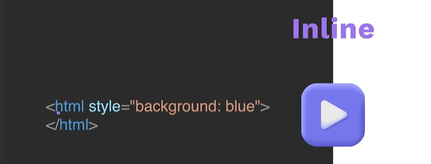


#### global attribute `style`

Global attribute style- available to all tags.


#### Internal


Inline add only when its very specific and not to use everywhere.

instead Internal is better.


##### selector


#### External

Most common


#### Summary 


#### Exercise

Documents\GitHub\WebDevUdemy\5.1. Adding CSS\index.html

```html
<!DOCTYPE html>
<html lang="en">
  <head>
    <meta charset="UTF-8" />
    <title>Adding CSS</title>
  </head>

  <body>
    <h1>Three Methods of Adding CSS</h1>
    <!-- Create 3 Links to The 3 Webpages: inline, internal and external -->
    <a href="./inline.html">Inline CSS page</a> <br />
    <a href="./internal.html">Internal CSS page</a> <br />
    <a href="./external.html">External CSS pages</a>
  </body>
</html>
```


inline.html

```html
<!DOCTYPE html>
<html lang="en">
  <head>
    <meta charset="UTF-8" />
    <title>Inline</title>
  </head>

  <body>
    <h1 style="color: blue">Style Me in Blue!</h1>
  </body>
</html>
```


internal.html

```html
<!DOCTYPE html>
<html lang="en">
  <head>
    <meta charset="UTF-8" />
    <title>Internal</title>
    <style>
      h1 {
        color: red;
      }
    </style>
  </head>

  <body>
    <h1>Style Me in Red!</h1>
  </body>
</html>

```


external.html

```html
<!DOCTYPE html>
<html lang="en">
  <head>
    <meta charset="UTF-8" />
    <title>External</title>
    <link rel="stylesheet" href="./style.css" />
  </head>
  <body>
    <h1>Style Me in Green</h1>
  </body>
</html>
```


style.css

```css
h1 {
  color: green;
}

```


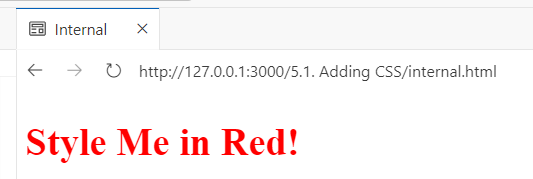


#### done


### 34. CSS Selectors


#### Element Selector


#### Class Selector


#### ID selector


#### Attribute Selector


https://developer.mozilla.org/en-US/docs/Web/HTML/Element/li


#### Exercise

Documents\GitHub\WebDevUdemy\5.3 CSS Selectors\index.html

```html
<!DOCTYPE html>
<html lang="en">

<head>
  <meta charset="UTF-8">
  <title>CSS Selectors</title>
  <link rel="stylesheet" href="./style.css" />
</head>

<body>
  <h1>CSS Selectors</h1>
  <h2>Applying CSS to Different Parts of HTML</h2>
  <!-- TODO 1: Set the CSS for all paragraph tags to "color: red" -->
  <p class="note">1. The element selector targets elements based on their HTML tag name.</p>

  <ol>
    <!-- TODO 2: Set the CSS for all elements with a class of "note" to "font-size: 20px" -->
    <li class="note" value="2">Class selectors target elements based on the value of the class attribute.</li>

    <!-- TODO 3: Set the CSS for the element with an id of "id-selector-demo" to "color: green" -->
    <li class="note" id="id-selector-demo" value="3">ID selectors target elements based on the value of the id
      attribute.</li>

    <!-- TODO 4: Set the CSS for the li elements that have the "value" attribute set to "4" to have "color: blue" -->
    <li class="note" value="4">Attribute selectors target elements based on their attributes and values.</li>

    <!-- TODO 5: Set all elements to have "text-align: center" -->
    <li class="note" value="5">The universal selector targets all elements.</li>
  </ol>
</body>

</html>
```


```css
ol {
  margin-left: -40px;
  margin-top: -20px;
  list-style-position: inside;
}

/* Write your CSS below, don't change the rules above. */
p {
  color: red;
}
.note {
  font-size: 20px;
}
#id-selector-demo {
  color: green;
}
li[value="4"] {
  color: blue;
}
html {
  text-align: center;
}
```


#### Done


###  35. [Project] Color Vocab Website


#### project

Documents\GitHub\WebDevUdemy\5.4 ColorVocabProject\index.html

```html
<!DOCTYPE html>
<html lang="en">
  <head>
    <meta charset="UTF-8" />
    <title>Spanish Vocabulary</title>
    <link rel="stylesheet" href="./style.css" />
  </head>

  <body>
    <h1>Colors</h1>
    <h2>Learn the colors in Spanish!</h2>
    <h2 class="color-title" id="red">Rojo</h2>
    

    <h2 class="color-title" id="blue">Azul</h2>
    

    <h2 class="color-title" id="orange">Anaranjado</h2>
    

    <h2 class="color-title" id="green">Verde</h2>
    

    <h2 class="color-title" id="yellow">Amarillo</h2>
    
  </body>
</html>

<!-- 
TODOs
IMPORTANT: You should not need to make ANY CHANGES to index.html
All code should be written in your CSS file.

1. Create a CSS file and incorporate it as an external stylesheet.
2. Use CSS to style each of the color titles to meaning. 
Hint: Use the id to help if you don't know the words in spanish.
3. Use CSS to change all the color titles to have "font-weight: normal;"
4. Use CSS (not HTML) to make all the images 200px heigh and 200px wide. 
Hint: 
https://developer.mozilla.org/en-US/docs/Web/CSS/height
https://developer.mozilla.org/en-US/docs/Web/CSS/width
-->

```

```css
#red {
  color: red;
}
#blue {
  color: blue;
}
#orange {
  color: orange;
}
#green {
  color: green;
}
#yellow {
  color: yellow;
}
.color-title {
  font-weight: normal;
}
img {
  height: 200px;
  width: 200px;
}
```


#### done


### 36. Tip from Angela


### 37. Join the Student community

report issue.

https://docs.google.com/forms/d/e/1FAIpQLSeZewm5WSjfb_VfOdkQCQpdunWl9FeIQlVhdYjSYK5fvM_fcw/viewform


## Section 6 - CSS Properties


### 38. CSS Colors


#### Named colors documentation

https://developer.mozilla.org/en-US/docs/Web/css/named-color


#### Important - color hunt	

https://colorhunt.co/


3rd one can be background. 1st one H1 and 2nd one h2.

#### Hex codes


#### RGB Mixer

https://www.csfieldguide.org.nz/en/interactives/rgb-mixer/


#### Exercise 

Documents\GitHub\WebDevUdemy\6.0 CSS Colors\index.html

```html
<!DOCTYPE html>
<html lang="en">
  <head>
    <meta charset="UTF-8" />
    <title>Colors</title>
    <style>
      /* Write your CSS code here. */
      /* 1. Make the background of the webpage "antiquewhite"
    2. Make the h1 "whitesmoke"
    3. Make the background of the h1 "darkseagreen"
    4. Make the h2 #FAF8F1
    5. Make the background of the h2 "#C58940" */
      body {
        background-color: antiquewhite;
      }
      h1 {
        color: whitesmoke;
        background-color: darkseagreen;
      }
      h2 {
        color: #faf8f1;
        background-color: #c58940;
      }
    </style>
  </head>

  <body>
    <h1>Hello</h1>
    <h2>World</h2>
  </body>
</html>

```


#### done


### 39. Font Properties


#### Font Size


#### Pixel vs Point


#### MS Word - points

Word uses Points 


#### 1em 1rem


​	

Recommend only REM & not EM


#### Font Size task

just play around to see how `em` and `rem` affects etc.

Documents\GitHub\WebDevUdemy\6.1 Font properties\font-size.html


```html
<!DOCTYPE html>
<html lang="en">
  <head>
    <meta charset="UTF-8" />
    <title>Font-Size</title>
    <style>
      #pixel {
        font-size: 20px;
      }

      #point {
        font-size: 20pt;
      }

      #em {
        font-size: 1em;
      }

      #rem {
        font-size: 1rem;
      }

      footer {
        font-size: 12pt;
      }

      html {
        font-size: xx-large;
      }
    </style>
  </head>

  <body>
    <p id="pixel">1 Pixel is 1/96 of an Inch</p>
    <p id="point">1 Point is 1/72 of an Inch</p>
    <footer>
      <p id="em">1em is 100% the size of the parent element</p>
      <p id="rem">1rem is 100% the size of the root element</p>
    </footer>
  </body>
</html>
```


#### font Weight

normal or bold


#### font-family


#### backup generic font family

Helvetica is mac typeface. So it may not be there on all computers so we have generic backup.

Sans serif - has edges at right angle on the bottom and edges.

if it has feet or decorations at edges its serif type.


put in double quotes if font family has space.


#### Custom font


##### Fonts.google.com


Choose whatever fonts you want.

and when you click on the Oswald for example it inside can show different Font Weights. Sometimes you can choose by font weight or here it chose all those as a whole on its own.


then go to the ICON on right top - View Selected Families.

Shows the couple i selected.

Then click on `Embed code1`


##### Embed Code and CSS

Then copy the the code.

This will go in `<link>` element inside the `<head>` ususally.

then the CSS can go into your styling and use those classes if need be.


##### task to do for custom font


Documents\GitHub\WebDevUdemy\6.1 Font properties\font-family.html

```html
<!DOCTYPE html>
<html lang="en">
  <head>
    <meta charset="UTF-8" />
    <title>Font Family</title>
    <style>
      .merriweather-light {
        font-family: "Merriweather", serif;
        font-weight: 300;
        font-style: normal;
      }

      .merriweather-regular {
        font-family: "Merriweather", serif;
        font-weight: 400;
        font-style: normal;
      }

      .merriweather-bold {
        font-family: "Merriweather", serif;
        font-weight: 700;
        font-style: normal;
      }

      .merriweather-black {
        font-family: "Merriweather", serif;
        font-weight: 900;
        font-style: normal;
      }

      .merriweather-light-italic {
        font-family: "Merriweather", serif;
        font-weight: 300;
        font-style: italic;
      }

      .merriweather-regular-italic {
        font-family: "Merriweather", serif;
        font-weight: 400;
        font-style: italic;
      }

      .merriweather-bold-italic {
        font-family: "Merriweather", serif;
        font-weight: 700;
        font-style: italic;
      }

      .merriweather-black-italic {
        font-family: "Merriweather", serif;
        font-weight: 900;
        font-style: italic;
      }
      /* // <uniquifier>: Use a unique and descriptive class name */
      /* // <weight>: Use a value from 200 to 700 */
      .oswald-example {
        font-family: "Oswald", serif;
        font-optical-sizing: auto;
        font-weight: 200;
        font-style: normal;
      }

      #helvetica {
        font-family: Helvetica, sans-serif;
      }

      #arial {
        font-family: Arial, sans-serif;
      }

      #serif {
        font-family: serif;
      }

      #sans-serif {
        font-family: sans-serif;
      }

      #cursive {
        font-family: cursive;
      }

      #monospace {
        font-family: monospace;
      }

      #fantasy {
        font-family: fantasy;
      }
    </style>
    <link rel="preconnect" href="https://fonts.googleapis.com" />
    <link rel="preconnect" href="https://fonts.gstatic.com" crossorigin />
    <link
      href="https://fonts.googleapis.com/css2?family=Merriweather:ital,wght@0,300;0,400;0,700;0,900;1,300;1,400;1,700;1,900&family=Oswald:wght@200..700&display=swap"
      rel="stylesheet"
    />
  </head>

  <body>
    <h1 class="oswald-example">Font family size</h1>
    <h2>heading 2 Font family size</h2>
    <h2 class="oswald-example">heading 2 Font family size</h2>
    <h2 class="merriweather-black-italic">heading 2 Font family size</h2>
    <p id="helvetica">Helvetica</p>
    <p id="arial">Arial</p>
    <p id="serif">Serif</p>
    <p id="sans-serif">Sans Serif</p>
    <p id="cursive">Cursive</p>
    <p id="monospace">Monospace</p>
    <p id="fantasy">Fantasy</p>
  </body>
</html>
```


#### text-align


#### Exercise 6.1

No Exercise 6.2

Documents\GitHub\WebDevUdemy\6.1 Font properties\index.html


```html
<!DOCTYPE html>
<html lang="en">
  <head>
    <meta charset="UTF-8" />
    <title>CSS Properties</title>
    <style>
      html {
        font-size: 30px;
      }
      body {
        background-color: cornflowerblue;
        color: white;
        font-size: 18px;
      }

      /* Don't change the CSS above, add Your CSS below */
      .coral {
        color: coral;
      }
      #fontSize {
        font-size: 2rem;
      }
      #fontWeight {
        font-weight: 900;
      }

      /* <uniquifier>: Use a unique and descriptive class name */
      /* <weight>: Use a value from 400 to 700 */

      .caveat-1 {
        font-family: "Caveat", cursive;
        font-optical-sizing: auto;
        font-weight: 400;
        font-style: normal;
      }
      #textAlign {
        text-align: right;
      }
    </style>
    <link rel="preconnect" href="https://fonts.googleapis.com" />
    <link rel="preconnect" href="https://fonts.gstatic.com" crossorigin />
    <link
      href="https://fonts.googleapis.com/css2?family=Caveat:wght@400..700&display=swap"
      rel="stylesheet"
    />
  </head>

  <body>
    <h1>Important CSS Properties</h1>
    <p class="coral">Color</p>
    <p id="fontSize">Font Size</p>
    <p id="fontWeight">Font Weight</p>
    <p class="caveat-1">Font Family</p>
    <p id="textAlign">Text Align</p>

    <!-- TODOs
  1. Change the color of <p>Color</p> to "coral" color.
  2. Change the font size of <p>Font Size</p> to 2X the size of the root font size.
  3. Change the font weight of <p>Font Weight</p> to 900.
  4. Change the font family of <p>Font Family</p> to the Google font Caveat with regular (400) font weight.
  Link: https://fonts.google.com/specimen/Caveat
  5. Change the <p>Text Align</p> to right align.
  6. Change the the root (html element) font size to 30px -->
  </body>
</html>
```


#### Done


### 40. Inspecting CSS


#### Developer tools or inspect

Chrome developer console or right click. & inspect

https://appbrewery.github.io/just-add-css/


#### Elements tab & style section


##### select an element button

you can then select Visually


#### style section


when you select `h2` in the style tab shows what styling has been applied to it.


#### Example - 

i can see what button and color etc and temporarily change it to PINK


#### automatic pre-loaded CSS

there is lot of automatic pre-loaded CSS.


when yours is in conflict with automatic one then they will appear in scratched (the automatic ones)


#### CSS file

when you do your own CSS it even tells which file its coming from.


in this example there was no style.css but as we see its Internal styling and external file.


#### Create styling


when yours is in conflict with automatic one then they will appear in scratched (the automatic ones)

how do you know final what is applied - 

#### Computed tab

ChatGpt- When inspecting a web page and looking at the elements in the "Elements" tab of the browser's developer tools, the "Computed" tab provides information about the computed styles of the selected element. This tab **<u>shows the final styles that are applied to the element after considering all CSS rules, inheritance, and browser defaults.</u>**

Here's what you can expect to see in the "Computed" tab:

1. **Computed Styles**: This section displays a list of CSS properties and their computed values for the selected element. These computed styles take into account all CSS rules that apply to the element, including styles inherited from parent elements and any browser default styles.
2. **Cascade**: The "Cascade" section shows the cascade of CSS rules that apply to the selected element, including the source (inline, user agent, author, etc.) and specificity of each rule. This helps you understand which CSS rules are influencing the computed styles of the element.
3. **Box Model**: The "Box Model" section provides information about the dimensions and positioning of the element, including its content area, padding, border, margin, width, height, and positioning properties (such as `position`, `top`, `left`, etc.).
4. **Typography**: If applicable, the "Typography" section may display information about font-related properties such as `font-family`, `font-size`, `line-height`, `font-weight`, `font-style`, etc.
5. **Color and Background**: Information about the color and background properties of the element, including `color`, `background-color`, `background-image`, `background-repeat`, `background-position`, etc.

By inspecting the computed styles in the "Computed" tab, you can gain insight into how CSS rules are affecting the appearance and layout of elements on the web page. This can be useful for debugging layout issues, understanding CSS specificity, and optimizing styles for performance and consistency.


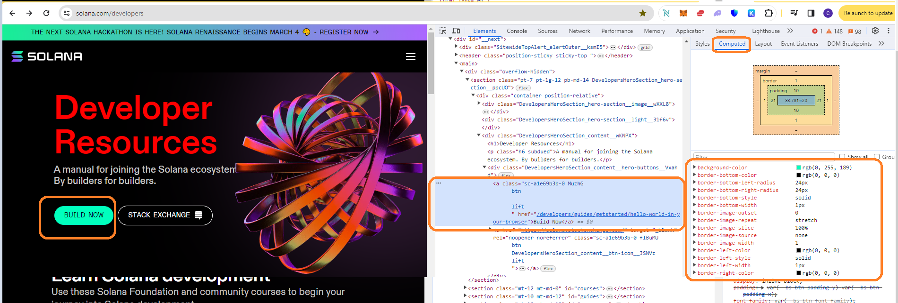


As you can see it also tells the rules sequence and how it has 2 rem which is 60 px. 

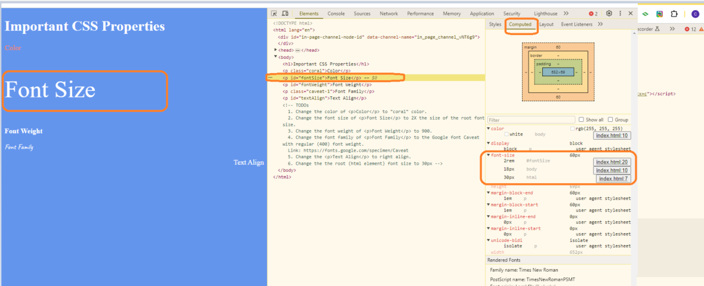


#### More Tools -> CSS Overview


then select `Capture overview`


#### Colors used

shows all the background colors, color used etc.


#### Fonts used

You can even check the Font being used.


#### Media Queries used


#### practice 

https://appbrewery.github.io/css-inspection/


You can go to Computed or just from styles you can get these.


#### done


### 41.The CSS Box Model - Margin, Padding and Border


#### Border

Pixel or percentages

Border- thickness style color


#### border-width


#### padding


#### margin


#### summary1


#### Task

you can play a bit here

https://appbrewery.github.io/box-model/


you can increase margin here and you see below image it increased.


more changes:


#### Summary2

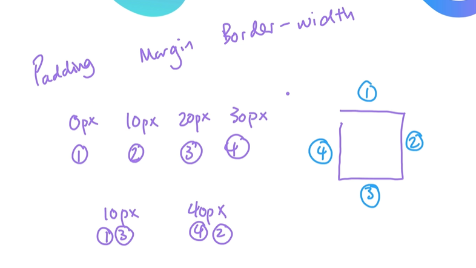


#### div element


#### Pesticide Extension


##### hovering on element


##### CTRL key

You have to hold down CTRL key.


#### Exercise 6.3

No Exercise 6.2

Documents\GitHub\WebDevUdemy\6.3 CSS Box Model\index.html

```html
<!DOCTYPE html>
<html lang="en">
  <head>
    <meta charset="UTF-8" />
    <title>CSS Box Model</title>
    <style>
      /* Write your CSS code here */
      div {
        height: 200px;
        width: 200px;
      }
      p {
        display: block;
        margin-block-start: 0px;
        margin-block-end: 0px;
        margin-inline-start: 0px;
        margin-inline-end: 0px;
      }
      body {
        display: block;
        margin-block-start: 0px;
        margin-block-end: 0px;
        margin-inline-start: 0px;
        margin-inline-end: 0px;
      }
    </style>
  </head>

  <body>
    <div
      style="
        background-color: cadetblue;
        padding: 20px;
        border: 10px solid black;
      "
    >
      <p>
        Lorem ipsum dolor sit amet, consectetur adipiscing elit. Aliquam at
        sapien porttitor urna elementum lacinia. In id magna pulvinar, ultricies
        lorem id, vehicula elit. Aliquam eu luctus nisl, vitae pellentesque
        magna. Phasellus dolor metus, laoreet ac convallis sit amet,
        efficitursed dolor.
      </p>
    </div>
    <div
      style="
        background-color: gold;
        border: 20px solid black;
        border-width: 20px 10px;
        margin-left: 260px;
      "
    ></div>
    <div
      style="
        background-color: indianred;
        border: 10px solid black;
        margin-left: 40px;
      "
    ></div>

    <!-- TODOs:
1. Create 3 Boxes using the div element.
2. Set their sizes to 200px heigh by 200px wide.
3. Set different background colors for each of the boxes (I used cadetblue, gold and indianred).
4. Add a paragraph <p> element into the first div and add the following words:
    Lorem ipsum dolor sit amet, consectetur adipiscing elit. Aliquam at sapien porttitor urna elementum lacinia. In
    id magna pulvinar, ultricies lorem id, vehicula elit. Aliquam eu luctus nisl, vitae pellentesque magna. Phasellus
    dolor metus, laoreet ac convallis sit amet, efficitur sed dolor.
5. Set the 1st div to have 20px padding all around with a black 10px border.
6. Fix the style of the <p> element to remove all margins.
Hint: Use the CSS inspector in Chrome.
7. Set the 2nd div to have a 20px border on top and bottom and 10px border left and right. (See goal image)
8. Set the 3rd div to have a 10px border 
9. Set the margins for the divs so that each box corner touches the other. (See the goal image)
-->
  </body>
</html>
```


### 42. [Project] Motivational Poster Website


#### project

Documents\GitHub\WebDevUdemy\6.4 Motivation Meme Project\index.html

i did differently but solution is better.

Also text you can align center, but image you just make width=100% so it fills the Div.

The hint in exercises is good, plus other important stuff - 

- center a div by giving it a width of 50% and a margin-left of 25%
- image to have a width of 100% so it fills the div
- text-transform: uppercase;

```html
<!-- 
  TODO: Create a motivational post website.
Style it how ever you like. 
Look at the goal image for inspiration.
But it must have the following features:
1. The main h1 text should be using the Regular Libre Baskerville Font from Google Fonts:
  https://fonts.google.com/specimen/Libre+Baskerville
2. The text should be white and background black.
3. Add your own image into the images folder inside assets. It should have a 5px white border.
4. The text should be center aligned.
5. Create a div to contain the h1, p and img elements. Adjust the margins so that the image and text are centered on the page. 
  Hint: You horizontally center a div by giving it a width of 50% and a margin-left of 25%.
  Hint: Set the image to have a width of 100% so it fills the div. 
6. Read about the text-transform property on MDN docs to make the h1 uppercase with CSS.
  https://developer.mozilla.org/en-US/docs/Web/CSS/text-transform 
-->
<!DOCTYPE html>
<html lang="en">
  <head>
    <meta charset="UTF-8" />
    <meta name="viewport" content="width=device-width, initial-scale=1.0" />
    <title>Document</title>
    <link rel="preconnect" href="https://fonts.googleapis.com" />
    <link rel="preconnect" href="https://fonts.gstatic.com" crossorigin />
    <link
      href="https://fonts.googleapis.com/css2?family=Libre+Baskerville:ital,wght@0,400;0,700;1,400&display=swap"
      rel="stylesheet"
    />
    <link rel="stylesheet" href="./style.css" />
  </head>
  <body>
    <div class="topDivClass">
      <div class="imageDivClass">
        
      </div>
      <div class="textClass">
        <h1 class="libre-baskerville-regular">That special Moment</h1>
        <p>When you find the perfect avocado at the supermarket</p>
      </div>
    </div>
  </body>
</html>


---- Solution body ---
<body>

  <div class="poster">
    
    <h1>That Special Moment</h1>
    <p>When you find the perfect avocado at the supermarket</p>
  </div>
</body>
```


Documents\GitHub\WebDevUdemy\6.4 Motivation Meme Project\style.css


```css
.libre-baskerville-regular {
  font-family: "Libre Baskerville", serif;
  font-weight: 400;
  font-style: normal;
}

.libre-baskerville-regular-italic {
  font-family: "Libre Baskerville", serif;
  font-weight: 400;
  font-style: italic;
}

.libre-baskerville-bold {
  font-family: "Libre Baskerville", serif;
  font-weight: 700;
  font-style: normal;
}

body {
  color: white;
  background-color: black;
}
.imageDivClass {
  border: 5px solid white;
}
.textClass {
  text-align: center;
}
.topDivClass {
  margin-left: 25%;
  width: 50%;
  margin-right: 25%;
  margin-top: 3%;
}
.imageClass {
  width: 100%;
}
h1 {
  text-transform: uppercase;
}


---- SOLUTION CSS
body {
  background-color: black;
}
h1 {
  text-transform: uppercase;
  font-size: 3rem;
}

.poster {
  width: 50%;
  margin-left: 25%;
  margin-top: 100px;
  color: white;
  font-family: "Libre Baskerville", serif;
  text-align: center;
}

.motivation-img {
  border: 5px solid white;
  width: 100%;
}

```


```
git remote set-url origin https://huggingface.co/spaces/rchak007/BackTester.git

```


#### done


## Section 7 - Intermediate CSS 


### 43. The Cascade - Specificity and Inheritance

Summary for Cascade rules.


Will be blue here since its later;


2nd `li` - `style` takes precedence over `class` which takes over `li`

3rd `li` - `.Three` is class so takes pr	ecedence over just `li`


#### exercise 7.0

Documents\GitHub\WebDevUdemy\7.0 CSS Cascade\index.html

```html
<!DOCTYPE html>
<html lang="en">

<head>
  <meta charset="UTF-8">
  <title>CSS Cascade</title>
  <link rel="stylesheet" href="./style.css">
</head>

<body>
  <div id="outer-box" class="box">
    <div class="box">
      <p>Yellow Text</p>
      <div class="box inner-box">
        <p class="white-text">White Text</p>
      </div>
    </div>
    <div class="box">
      <p>Yellow Text</p>
      <div class="box inner-box">
        <p class="white-text">White Text</p>
      </div>
    </div>
  </div>
</body>

</html>
```


Documents\GitHub\WebDevUdemy\7.0 CSS Cascade\style.css

```css
/* Don't change the existing CSS. */

.box {
  background-color: blue;
  padding: 10px;
}

p {
  color: yellow;
  margin: 0;
  padding: 0;
}

/* my changes */
.inner-box {
  /* this has to be below .box to work due to specificity rules */
  background-color: red;
}
.inner-box p {
  /* could have done .white-text class */
  color: white;
}
#outer-box {
  background-color: purple;
}


------------- SOLUTION - 
#outer-box {
  background-color: purple;
}

.box {
  background-color: blue;
  padding: 10px;
}

.inner-box {
  background-color: red;
}

p {
  color: yellow;
  margin: 0;
  padding: 0;
}

.white-text {
  color: white;
}
```


#### order important

since .box and .inner-box are both classes the order is important since both classes are used.

```html
      <div class="box inner-box">
        <p class="white-text">White Text</p>
      </div>
```


#### done


### 44. Combining CSS Selectors


#### Combine class and paragraph


#### group selectors with comma , 


#### child


#### descendent


#### chaining


##### Order - element first

element has to go first


#### Combining combiners


 


#### exercise

was earlier tasks - 

Documents\GitHub\WebDevUdemy\7.1 Combining Selectors\index.html

```html
<!DOCTYPE html>
<html lang="en">

<head>
  <meta charset="UTF-8">
  <title>Combining CSS Selectors</title>
  <link rel="stylesheet" href="./style.css">
</head>

<!-- Don't change any of the HTML code! -->

<body>
  <h1>To Do List</h1>
  <h2>Monday</h2>
  <div class="box">
    <p class="done">Do these things today!</p>
    <ul class="list">
      <li>Wash Clothes</li>
      <li class="done">Read</li>
      <li class="done">Maths Questions</li>
    </ul>
  </div>

  <ul>
    <p class="done">Other items</p>
  </ul>
  <p>The best preparation for tomorrow is doing your best today.</p>

</body>

</html>
```


\Documents\GitHub\WebDevUdemy\7.1 Combining Selectors\style.css


```css
/* Write your code here: */
h1,
h2 {
  color: blueviolet;
}
.box > p {
  color: firebrick;
}

/* .list {
    color: blue;
} */

/* also works */
/* div li {
  color: blue;
} */
.box li {
  color: blue;
}

/* Chaining */
li.done {
  color: seagreen;
}

/* combining combiner */
ul > p.done {
  font-size: 0.5rem;
}
```


#### done


### 45. CSS Positioning


#### 4 positions


#### Default is Static

left 50px and top 50px does not matter for Static - it will ignore and just start immediate after previous element - thats why its greyed out.


#### play task


https://appbrewery.github.io/css-positioning/


So the below left and top are fixed for all boxes. Here you see 5 divs with different classes. and `style.css` and in the css it defines static, relative, etc.

```
  left: 50px;
  top: 50px;
```


then it uses the descendent method actually - 


```
.static .box {
  position: static;
  left: 50px;
  top: 50px;
}

.relative .box {
  position: relative;
  left: 50px;
  top: 50px;
}
```


Static just goes to next position below the `top: 50pm` text.


##### View with Pesitcide


#### Relative

Relative to only its own position;


relative from itself (which was Static) now moves left 50 and top 50.


#### Absolute

important distinction - only the ancestor that is positioned matter. So i have few ancestors but that did not use Position relative then it will just to use the top left corner just like in this example she gave.


when no nearest ancestor then goes takes position from top left of webpage.


this since has no ancestor with Relative position goes from top left corner. has ancestors but they dont have relative. Thats why goes to top left corner to use top and left from there.


when i added style for that ancestor - then it shifts.


Below - ancestors of the div green box. since ancestors none of them have position relative set m, green box went off of the top left corner webpage.


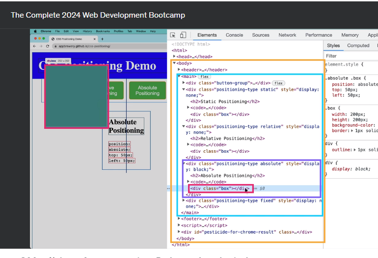


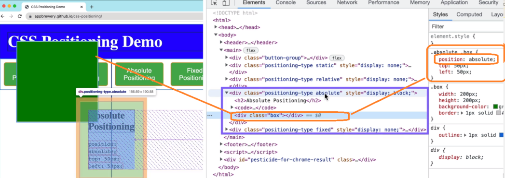


#### Z-index

3rd dimension - which goes on top of which


now green box is behind others - as we set z-index = -1;


#### Fixed

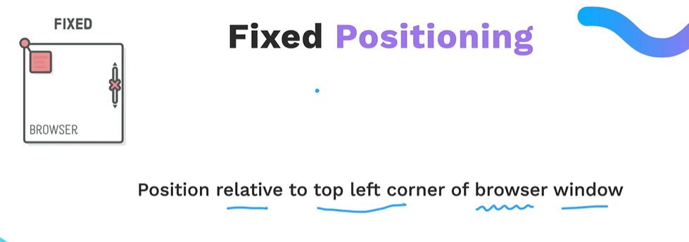


#### position , margin, border, padding


#### exercise


Documents\GitHub\WebDevUdemy\7.2 CSS Positioning\index.html


```html
<!DOCTYPE html>
<html>
  <head>
    <title>CSS Positioning Exercise</title>
    <style>
      /* Write your code here */
      .blue-box {
        background-color: blue;
        position: relative; /* could be absolute or fixed too in this case */
        top: 200px;
        left: 200px;
        width: 500px;
        height: 300px;
      }
      .red-circle {
        background-color: red;
        position: absolute;
        top: 150px; /* or can be 50% too */
        left: 250px; /* or can be 50% too */
        width: 200px;
        height: 200px;
        border-radius: 50%;
      }
    </style>
  </head>

  <body>
    <div class="blue-box">
      <div class="red-circle"></div>
    </div>
  </body>
</html>
```


#### circle

##### border-radius 50%


#### Important - div

will not show unless you add width and height.


### 46. [Project] CSS Flag


#### Painting with CSS - crazy


#### Simpsons in CSS


#### project


```html
<!DOCTYPE html>
<html lang="en">
  <head>
    <meta charset="UTF-8" />
    <title>CSS Flag Project</title>
    <style>
      /* Write your CSS Code here */
      body {
        margin: 0 0 0 0;
      }
      p {
        margin: 0 0 0 0;
      }
      .flag {
        width: 900px;
        height: 600px;
        background-color: rgb(206, 17, 38);
        margin: 0 0 0 0;
        position: relative;
      }

      /* Blue middle */
      .flag > div {
        background-color: rgb(0, 40, 104);
        /* width: 100px; */
        height: 300px;
        width: 900px;
        position: absolute;
        top: 25%;
      }

      /* Circle  */
      .flag > div > div > p {
        position: absolute;
        background-color: rgb(255, 255, 255);
        border-radius: 50%;
        width: 200px;
        height: 200px;
        left: 350px;
        top: 50px;
        font-size: 70px;
        color: black;
        text-align: center;
      }

      .flag > p {
        color: white;
        font-size: 70px;
        text-align: center;
        position: relative;
        top: 5%;
      }
    </style>
  </head>

  <!-- 
  IMPORTANT! Do not change any HTML
Don't add any classes/ids/elements 
Use what you know about combining selectors 
and CSS specificity instead.
Hint 1: The flag is 900px by 600px and the circle is 200px by 200px.
Hint 2: You can use CSS inspection to get the colors from
https://appbrewery.github.io/flag-of-laos/
-->

  <body>
    <div class="flag">
      <p>The Flag</p>
      <div>
        <div>
          <p>of Laos</p>
        </div>
      </div>
    </div>
  </body>
</html>

```

​	


#### done


### 47. Tip from Angela- nothing easy is worth doing


## Section 8 - Advanced CSS 


### 48. CSS Display


#### span


#### Default display is block

#### display inline


##### Default to content size

you cant set height and width;

see - Documents\GitHub\WebDevUdemy\8.0 CSS Display\spantest.html

```html
    <p class="test">Just some random <span> spanTest2</span> here</p>
    <p class="test3">Just some random <span> spanTest2</span> here</p>

```


#### Inline-block


#### none

disappears;


#### link to play

https://appbrewery.github.io/css-display/


#### Exercise


Documents\GitHub\WebDevUdemy\8.0 CSS Display\index.html

```html
<!DOCTYPE html>
<html>
  <!-- 
  TODO
1. By changing only the display property of the CSS make all 3 squares line up horizontally like in goal1 image.
2. Change only the display property to make all 3 squares line up vertically like in goal2 image. 
-->

  <head>
    <title>CSS Display Property Example</title>
    <style>
      p {
        color: white;
      }

      .red {
        display: inline-block;
        width: 200px;
        height: 200px;
        background-color: red;
      }

      .green {
        display: inline-block;
        width: 200px;
        height: 200px;
        background-color: green;
      }

      .blue {
        display: inline-block;
        width: 200px;
        height: 200px;
        background-color: blue;
      }
    </style>
  </head>

  <body>
    <h1>CSS Display Property</h1>
    <p class="red">Red Paragraph</p>
    <p class="green">Green Paragraph</p>
    <p class="blue">Blue Paragraph</p>
  </body>
</html>

```


Documents\GitHub\WebDevUdemy\8.0 CSS Display\index2.html

```html


<!DOCTYPE html>
<html>
  <!-- 
  TODO
1. By changing only the display property of the CSS make all 3 squares line up horizontally like in goal1 image.
2. Change only the display property to make all 3 squares line up vertically like in goal2 image. 
-->

  <head>
    <title>CSS Display Property Example</title>
    <style>
      p {
        color: white;
      }

      .red {
        display: block;
        width: 200px;
        height: 200px;
        background-color: red;
      }

      .green {
        display: block;
        width: 200px;
        height: 200px;
        background-color: green;
      }

      .blue {
        display: block;
        width: 200px;
        height: 200px;
        background-color: blue;
      }
    </style>
  </head>

  <body>
    <h1>CSS Display Property</h1>
    <p class="red">Red Paragraph</p>
    <p class="green">Green Paragraph</p>
    <p class="blue">Blue Paragraph</p>
  </body>
</html>

```


#### own exercise Span

Documents\GitHub\WebDevUdemy\8.0 CSS Display\spantest.html


### 49. CSS Float


00:24 - Wrap text around element - float

00:38 - Do this diff size blocks (did that actually under own exercise)

00:51 - Try a Div & assign float to it & keep IMG & p for text (later in exercise we did anyways)

02:32 - Example

5:14 - Footer clear left

5;16 - Clear

5:25 - Clear

6:08 - Practice float on Div too; not just image (already kind of did it)

6:19 - Clear both (we do this in exercise)

6:24 - Clear:both  (we do this in exercise)

6:32 - Exercise- done.

11:11 - Float is not used in this way anymore

11:30 - Only use when you wrap text around image


#### Own exercise

 to have inline blocks like newspaper format - (0:38 secs)

Documents\GitHub\WebDevUdemy\8.1 CSS Float\test1.html

```html
<!DOCTYPE html>
<html>


  <head>
    <title>CSS Display Property Example</title>
    <style>
      p {
        color: black;
      }
      h1 {
        display: inline-block;
        background-color: yellow;
        width: 350px;
        height: 250px;
      }
      .block1 {
        display: inline-block;
        background-color: aqua;
        width: 200px;
        height: 100px;
      }
      .block2 {
        display: inline-block;
        background-color: bisque;
        width: 150px;
      }
    </style>
  </head>

  <h1>CSS Display Property</h1>
  <p class="block1">Block1 Paragraph</p>
  <p class="block2">Block2 Paragraph</p>
</html>
```


was mimicking diff block size like below in above exercise.


#### float

##### right


#### clear


#### clear: both

#### Only use when you wrap text around image

usually used in this way mostly.


#### Exercise 

Documents\GitHub\WebDevUdemy\8.1 CSS Float\index.html

```html
<!DOCTYPE html>
<html lang="en">
  <!-- TODO
1. Make both paragraph elements wrap around the image.
2. Use Float to move the cat div to the left and the dog div to the right.
3. Use clear to make the footer go below both the cat and dog div. -->

  <head>
    <meta charset="UTF-8" />
    <title>CSS Float</title>
    <style>
      div {
        display: inline-block;
        width: 40%;
      }

      p {
        font-size: 2em;
      }

      .cat {
        background-color: aquamarine;
      }
      .cat img {
        float: left;
      }

      .dog {
        background-color: coral;
        float: right;
      }
      .dog img {
        float: left;
      }

      footer {
        text-align: center;
        background-color: blueviolet;
        clear: both;
      }
    </style>
  </head>

  <body>
    <div class="cat">
      <h2>CatCSS</h2>

      
      <p class="first-paragraph">
        Nap all day cat dog hate mouse eat string barf pillow no baths hate
        everything but kitty poochy. Sleep on keyboard toy mouse squeak roll
        over. Mesmerizing birds. Poop on grasses licks paws destroy couch
        intently sniff hand. The dog smells bad gnaw.
      </p>
    </div>
    <div class="dog">
      <h2>DogCSS</h2>
      
      <p class="second-paragraph">
        Heckin good boys and girls long woofer big ol wow very biscit long
        woofer heck what a nice floof, long doggo noodle horse vvv very taste
        wow. Very taste wow many pats aqua doggo he made many woofs pupperino,
        puggo doing me a frighten.
      </p>
    </div>

    <footer>Copyright. This is the footer</footer>
  </body>
</html>

```


### 50. Responsive Websites


2:09 - 4 responsive ways to

3;24 Media Query

4:47 - Display grid

7:54 - Grid small summary

7:59 - Try this as is as small exercise

10:49 - How to do 2 of them - do as exercise

11:24 - Flex box summary

12:00 - Try this on your own with some Div in flex & some not etc & see what happens

14:03 - Bootstrap built on top of flex box -

14:17 - 12 part

15:49 - Responsiveness built in & styles

16:20 - Good. One to do again

17:36 - Exercise


#### 4 responsive ways

2:09 - 4 responsive ways to


#### Media Query

3;24 Media Query

we will look deeper in next lesson. 


#### display Grid

4:47 - Display grid

##### grid-template-columns

##### grid-template-rows


##### gap 

##### grid-column Span


##### Grid Summary

7:54 - Grid small summary


##### Own exercise

7:59 - Try this as is as small exercise - from above code

Documents\GitHub\WebDevUdemy\Test\test50-01-CSS-Grid.html

```html
<html>
  <head>
    <style>
      .grid-container {
        display: grid;
        grid-template-columns: 1fr 1fr;
        grid-template-rows: 100px 200px 200px;
        gap: 30px;
      }
      .first {
        grid-column: span 2;
        background-color: bisque;
      }
      .card {
        background-color: blue;
      }
    </style>
  </head>

  <body>
    <div class="grid-container">
      <div class="first"></div>
      <div class="card"></div>
      <div class="card"></div>
      <div class="card"></div>
      <div class="card"></div>
    </div>
  </body>
</html>
```


Since we use `grid` its auto responsive.


Grid applies to 2D layout with rows and columns

#### CSS Flex

##### 1D layout

Grid applies to 2D layout with rows and columns then Flex is good at 1D layout.


##### display: flex

##### flex:1


10:49 - How to do 2 of them - do as exercise


##### Flex in column direction too


##### No Fixed width

since its not fixed width and is more %age of total width, it will easily be responsive when web page width changes. 


##### own exercise.


Documents\GitHub\WebDevUdemy\Test\test50-02-CSS-Flex.html


```html
<html>
  <head>
    <style>
      .flex-container {
        display: flex;
      }

      .card {
        background-color: blue;
        border: 30px solid white;
        height: 100px;
        flex: 1;
      }
      .first {
        flex: 2;
      }
      .second {
        flex: 0.5;
      }
    </style>
  </head>

  <body>
    <div class="flex-container">
      <div class="first card"></div>
      <div class="second card"></div>
      <div class="card"></div>
      <div class="card"></div>
    </div>
    <!-- my additions -->
    <div class="flex-container">
      <div class="first card"></div>
      <div class="second card"></div>
      <div class="card"></div>
      <div class="card"></div>
    </div>
  </body>
</html>
```


#### Bootstrap framework


Its framework because its external and not built into CSS like grid and flexbox.

We bring in other people's code.

whole bunch of classes have been defined. lot of styling is automatically applied.

its built on FlexBox.

12 div system. 12 columns.


#### exercise

was only to check it out. nothing to do.

Documents\GitHub\WebDevUdemy\8.2 Responsiveness\index.html


### 51. Media Queries


0:41 - Syntax

3:32 - More conditions

5:33 - Screen not recommended .. but also print similar

5:47 - Docs	

6:29 - Exercise

8:25 - Simulation of different devices from chrome

8:37 - Devices chrome


#### Syntax


#### Combine - more conditions

3:32 - More conditions


#### Screen / Print

5:33 - Screen not recommended .. but also print similar

Screen not recommended .. but also print similar


#### Docs

5:47 - Docs

https://developer.mozilla.org/en-US/docs/Web/CSS/CSS_media_queries/Using_media_queries


#### Exercise

6:29 - Exercise

Documents\GitHub\WebDevUdemy\8.3 Media Query\index.html

```html
<!DOCTYPE html>
<html lang="en">
  <!-- 
TODO: Change the background color for each device
[lightsalmon] Mobile Devices: 319px — 480px
[powderblue] iPads and Tablets: 481px — 1200px
[limegreen] Laptops: 1201px — 1600px
[seagreen] Desktops: 1601px and more
-->

  <head>
    <meta charset="UTF-8" />
    <meta
      name="viewport"
      content="width=device-width, initial-scale=1, minimum-scale=1"
    />
    <title>Media Query</title>
    <style>
      @media (min-width: 1601px) {
        body {
          background-color: seagreen;
        }
      }
      @media (min-width: 1201px) and (max-width: 1600px) {
        body {
          background-color: limegreen;
        }
      }
      @media (min-width: 481px) and (max-width: 1200px) {
        body {
          background-color: powderblue;
        }
      }
      @media (min-width: 319px) and (max-width: 480px) {
        body {
          background-color: lightsalmon;
        }
      }
    </style>
  </head>

  <body></body>
</html>
```


#### Simulate different devices

8:25 - Simulation of different devices from chrome

8:37 - Devices chrome


### 52. Project - Web Design Agency Website


Dimensions:

Next hub max - 1280 x 800

Nest Hub - 1024 x 600

Samsung Galaxy A51/71 - 412 x 914

Ipad Pro - 1024 x 1366	

Iphone Max pro - 430 x 932


#### My Solution

Documents\GitHub\WebDevUdemy\Test\8.4 Web Design Agency Project\index.html


Need to reDo again once -


```html
<!DOCTYPE html>
<html lang="en">
  <head>
    <meta charset="UTF-8" />
    <meta name="viewport" content="width=device-width, initial-scale=1.0" />
    <title>Agency</title>
    <link rel="stylesheet" href="./style.css" />
    <link rel="preconnect" href="https://fonts.googleapis.com" />
    <link rel="preconnect" href="https://fonts.gstatic.com" crossorigin />
    <link
      href="https://fonts.googleapis.com/css2?family=Poppins:wght@400;700&display=swap"
      rel="stylesheet"
    />
  </head>

  <body>
    <div class="main">
      
      <h1>We are a <span class="span">Creative</span> Design Agency</h1>
      <div class="flex-container">
        <div class="left card">
          
          <h2 class="card-title">Beauty</h2>
          <p>
            We strive to create the most beautiful websites for all your needs.
            Working closely with you to design and develop an amazing website
            for your business.
          </p>
        </div>

        <div class="right card">
          
          <h2 class="card-title">Construction</h2>
          <p>
            Built by our team of professional developers, we ensure the most
            rigourous and modern websites. Built from scratch using HTML and
            CSS. Only the best for you.
          </p>
        </div>
      </div>
    </div>
    <footer>
      <p>Create. Develop. Design.</p>
    </footer>
  </body>
</html>

```


Documents\GitHub\WebDevUdemy\8.4 Web Design Agency Project\style.css

```css
@media (min-width: 768px) {
  body {
    font-family: "Poppins", sans-serif;
    margin: 50px 50px 0 50px;
    background-color: #faf9f6;
    display: flex;
    flex-direction: column;
    min-height: 95vh;
  }
  .flex-container {
    display: flex;
  }
  .card {
    flex: 1;
  }
  .main {
    flex: 1;
  }

  .tile-image {
    float: left;
    width: 40%;
    height: 85%;
    margin-right: 5%;
  }
  h1 {
    font-size: 5rem;
    width: 100%;
  }
  p {
    width: 90%;
  }
}

@media (max-width: 767px) {
  body {
    font-family: "Poppins", sans-serif;
    margin: 50px 50px 0 50px;
    background-color: #faf9f6;
    display: flex;
    flex-direction: column;
    min-height: 95vh;
  }

  .main {
    flex: 1;
  }

  .tile-image {
    width: 100%;
    height: 100%;
    margin-right: 5%;
  }
  h1 {
    font-size: 5rem;
    width: 100%;
    font-size: 56px;
  }
}

.span {
  color: navy;
}

/* h2 {
  margin-left: 20px;
} */

footer {
  text-align: right;
  color: midnightblue;
}

```


#### From Solution


Documents\GitHub\WebDevUdemy\8.4 Web Design Agency Project\solution.html

```html
<!DOCTYPE html>
<html lang="en">
  <head>
    <meta charset="UTF-8" />
    <meta name="viewport" content="width=device-width, initial-scale=1.0" />
    <title>Agency</title>
    <link rel="stylesheet" href="./solution.css" />
    <link rel="preconnect" href="https://fonts.googleapis.com" />
    <link rel="preconnect" href="https://fonts.gstatic.com" crossorigin />
    <link
      href="https://fonts.googleapis.com/css2?family=Poppins:wght@400;700&display=swap"
      rel="stylesheet"
    />
  </head>

  <body>
    <div class="main">
      
      <h1>
        We are a <span class="creative">Creative</span> <br />Design Agency
      </h1>
      <div class="left card">
        
        <h2 class="card-title">Beauty</h2>
        <p class="card-text">
          We strive to create the most beautiful websites for all your needs.
          Working closely with you to design and develop an amazing website for
          your business.
        </p>
      </div>

      <div class="right card">
        
        <h2 class="card-title">Construction</h2>
        <p>
          Built by our team of professional developers, we ensure the most
          rigourous and modern websites. Built from scratch using HTML and CSS.
          Only the best for you.
        </p>
      </div>
    </div>
    <footer>
      <p>Create. Develop. Design.</p>
    </footer>
  </body>
</html>

```


Documents\GitHub\WebDevUdemy\8.4 Web Design Agency Project\solution.css

```css
body {
  font-family: "Poppins", sans-serif;
  margin: 50px 50px 0 50px;
  background-color: #faf9f6;
  display: flex;
  flex-direction: column;
  min-height: 95vh;
}
.main {
  flex: 1;
}

h1 {
  font-size: 5rem;
}

footer {
  text-align: right;
  color: midnightblue;
}

.tile-image {
  height: 200px;
  float: left;
  margin-right: 50px;
}

.card {
  width: 45%;
}

.left {
  float: left;
}

.right {
  float: right;
}

.creative {
  color: midnightblue;
}

@media (max-width: 680px) {
  .logo {
    width: 100px;
  }

  h1 {
    font-size: 3.5rem;
    text-align: center;
  }

  .card {
    width: 100%;
    display: block;
    margin-bottom: 30px;
    text-align: justify;
  }

  .card img {
    margin-bottom: 10px;
    width: 100%;
    display: inline;
    object-fit: cover;
  }
}

```


##### Technique

used Float left and right on the left and right div classes. 

And inside when 1st one  starts float again. 

This above is for full size,

For smaller size - they made it 100% width.


### 53. Tip from Angela - how to deal with Procrastination


## Section 9 - FlexBox


### 54. Display: Flex


1:38 - Table

2:09 - No no for styling - only if real table is needed

4:52 - 2005-2010 - floats were used

5:31 - Float when to use

6:41 - Flex; can do easily do layout
Gap ;

7:36 - Display - good advice

8:12 - Good summary

8:23 - Now flex

8:52 - Now this in flex box

9:37 - Default 100%width

10:02 - In-line flex


#### Table

1:38 - Table

they used to use HTML for tables before. still is in use in modern times.   And use only if you really need table.

but dont use for styling .


2:09 - No no for styling - only if real table is needed


#### Inline Block 

then they used this for layouts. there are problems with this too.


#### Another inflexible way 

Absolute - 

just illustrating evolution. even this it NOT ideal and inflexible. not responsive.


#### Float 

2005-2010 - floats were used for layout.


4:52 - 2005-2010 - floats were used


too hacky. hard to fix.


5:31 - Float when to use


##### Float when to use


dont use float for layout.


https://saijogeorge.com/css-puns/


#### Flexbox

incredibly easy to use

wrap it in a container.

##### display: flex

6:41 - Flex; can do easily do layout

##### Gap ;


7:36 - Display - good advice

this flex is not like inline-block, block etc.. need to think of this totally separately.

8:12 - Good summary

##### w/o flex


8:23 - Now flex


##### with flex

8:52 - Now this in flex box - it will ignore block display properties now.

so in Div it will show all its content as its width, so its not necessarily same as other columns.


9:37 - Default 100%width

flex will give whole page width. 


##### Inline-flex

10:02 - In-line flex

when you do this inline flex then you dont get full width now.


#### Exercise


GitHub\WebDevUdemy\9.0 Display Flex\index.html

just arrange the vertical to horizontal.

using gap or 1 rem.


```html
<!DOCTYPE html>
<html lang="en">

<head>
  <meta charset="UTF-8">
  <meta name="viewport" content="width=device-width, initial-scale=1.0">
  <title>Column Layout Methods</title>
  <style>
    p {
      padding: 0;
      margin: 0;
      font-weight: 700;
    }

    li {
      list-style: none;
    }

    .container {
      padding: 10px;
      background-color: gold;
    }
    /* added this  */
    .container {
      display: flex;
      gap: 10px;
    }

  </style>
</head>

<body>
  <div class="container">
    <p>Page Layout Methods</p>

    <li><a href="./html-table.html">HTML Table</a></li>
    <li><a href="./inline-block.html">Inline-Block</li>
    <li><a href="./absolute-position.html">Absolute Positioning</li>
    <li><a href="./float.html">Float</li>
    <li><a href="./flex.html">Flexbox</li>

  </div>
</body>

</html>
```


### 55. Flex Direction


Row and Column layouts


default - Block and inline block. go from top to bottom.

Flex - its like container into the Row.


#### Flex Direction

because of Flex direction. Default direction is Row.

Think how next item is stacked onto other. Its like rows.

you are setting the Main axis. Left to right.


Cross Axis - vertical - top to bottom.


now main axis top to bottom. Cross axis is left to right.

#### flex-basis: 100px;

Has to be on the Child and not container.

if its larger basis - it will set width if its Row. 


#### Exercise - 

9.1-Flex-Direction\9.1 Flex Direction\index.html

change it to vertical. height is 100px.

##### display: inline-flex;

```html
<!DOCTYPE html>
<html lang="en">
  <head>
    <meta charset="UTF-8" />
    <meta name="viewport" content="width=device-width, initial-scale=1.0" />
    <title>Flex Direction</title>
    <!-- HINT:
  https://developer.mozilla.org/en-US/docs/Web/CSS/Universal_selectors
  https://developer.mozilla.org/en-US/docs/Learn/CSS/Building_blocks/Selectors/Combinators 
  -->
    <style>
      .container {
        color: white;
        border: 5px solid gold;
        display: flex;
        flex-direction: column;
        /* width: 50px; */
        display: inline-flex;
      }
      div > div {
        flex-basis: 100px;
      }

      /*
Select all the elements that are the direct
children of the .container class.
    */

      .red {
        background-color: #eb4d4b;
      }
      .orange {
        background-color: #f0932b;
      }
      .yellow {
        background-color: #f6e58d;
      }
      .green {
        background-color: #6ab04c;
      }
      .blue {
        background-color: #4834d4;
      }
      .indigo {
        background-color: #30336b;
      }
      .purple {
        background-color: #be2edd;
      }
    </style>
  </head>

  <body>
    <div class="container">
      <div class="red">Red</div>
      <div class="orange">Orange</div>
      <div class="yellow">Yellow</div>
      <div class="green">Green</div>
      <div class="blue">Blue</div>
      <div class="indigo">Indigo</div>
      <div class="purple">Purple</div>
    </div>
  </body>
</html>

```


#### done


### 56. Flex Layout


default

#### order: 0;


#### order


default:

#### flex-wrap: nowrap;


#### flex-wrap: wrap;


This is property on the parent.


5:49

#### demo

https://appbrewery.github.io/flex-layout/


#### justify-content: flex-start;

Flex start


#### justify-content: flex-start;


#### justify-content: center


#### justify-content: space-between

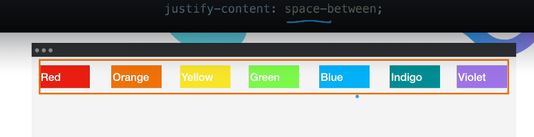


#### align-items: flex-start;

#### height: 70vh;    (viewport height)


#### demo - 

https://appbrewery.github.io/flex-layout/

try different options here - align-items: stretch

12;36

Works better no wrap for some of the align items


#### align-self

on the item and not container


#### cheat sheet (IMP)

https://css-tricks.com/snippets/css/a-guide-to-flexbox/


#### Align content

Align content only works w wrap


17:09

#### froggy game

 https://appbrewery.github.io/flexboxfroggy/


this below link very imp to learn to play to know how to place them.

https://appbrewery.github.io/flex-layout/


##### level 4


​	

##### level 5 


##### level 6


##### Level 7


##### Level 8


##### level 9


##### level 10


##### level 11


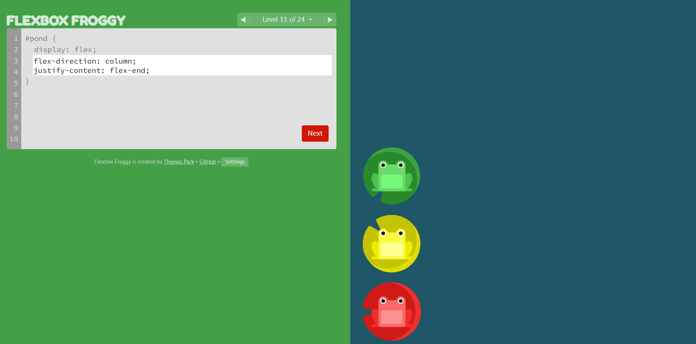


##### Level 12


##### level 13


##### Level 14


##### level 15


##### level 16


##### level 17


##### level 18


##### level 19

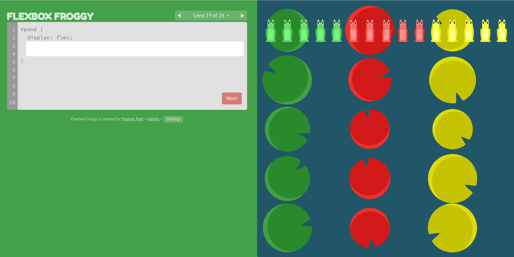


##### level 20

same as above but only 1 line seems like; 


##### level 21


##### level 22


##### level 23


##### level 24


### 57. Flex Sizing


#### Algo


start


4:35 

#### Shrink

min. content size


Good to know it goes to min content size


#### default behavior

5:32

Default behavior w/o anything else applied.


#### max-width

is length of text.


#### min-width

longest word.


#### width

6:24

manual width- 100px.


#### flex-basis

9:01


#### max and min width


11:35


#### width vs flex-basis

whichever is smaller looks like;


13:38


#### flex-grow, flex-shrink

14:38


if both are 0, then its almost like not even a flex box.


#### flex-grow

15:50


#### default setting


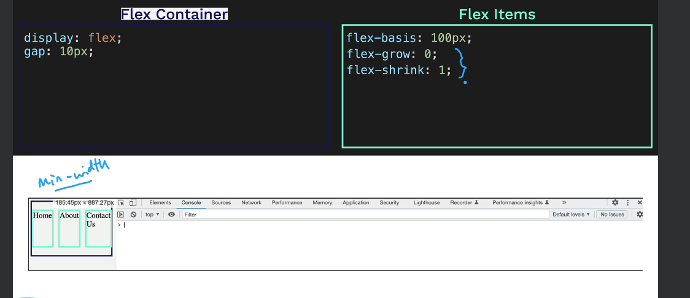


#### flex-basis default auto

18:24


#### flex-basis equal

18:46


#### shorthand


#### even shorter

19:31


#### flex:1, flex:2 ...

20:14


#### Exercise

20:34

its online.


https://appbrewery.github.io/flexbox-sizing-exercise/


```css
/* Write your CSS code below to make the blue items size, grow and shrink like the green ones.*/

.container {
  display: flex;
  justify-content: space-between; 

}
  
.container > * {
background-color: green;

}

.item1 {
flex-basis: 200px;
}

.item2 {

min-width: 200px; 
}

.item3 {

min-width: 400px;
}
```


##### solution


### 58. Project Pricing Table


GitHub\WebDevUdemy\9.4-FlexBox-PricingTableProject\index.html


#### Solution 

```html
<!DOCTYPE html>
<html>

<head>
  <title>Flexbox Pricing Table</title>
  <link rel="preconnect" href="https://fonts.googleapis.com">
  <link rel="preconnect" href="https://fonts.gstatic.com" crossorigin>
  <link href="https://fonts.googleapis.com/css2?family=Sono:wght@400;700&display=swap" rel="stylesheet">
  <style>
    body {
      font-family: 'Sono', sans-serif;
    }

    .pricing-container {
      display: flex;
      justify-content: center;
      align-items: center;
      height: 100vh;
      gap: 2rem;
    }

    .pricing-plan {
      flex: 1;
      max-width: 400px;
      padding: 20px;
      background-color: #f2f2f2;
      border-radius: 5px;
      text-align: center;
    }

    .plan-title {
      font-size: 24px;
      font-weight: bold;
      margin-bottom: 10px;
    }

    .plan-price {
      font-size: 48px;
      font-weight: bold;
      margin-bottom: 10px;
    }

    .plan-features {
      list-style: none;
      padding: 0;
      margin: 0;
    }

    .plan-features li {
      margin-bottom: 20px;
    }

    .plan-button {
      padding: 10px;
      background-color: #ff6600;
      color: #fff;
      border-radius: 5px;
      border: none;
    }

    @media (max-width: 1250px) {
      .pricing-container {
        flex-direction: column;
        height: 100%;
      }
    }
  </style>
</head>

<body>
  <div class="pricing-container">
    <div class="pricing-plan">
      <div class="plan-title">Basic</div>
      <div class="plan-price">$11.99/month</div>
      <ul class="plan-features">
        <li>✅ 10GB Storage</li>
        <li>✅ 1 User</li>
        <li>🚫 Support</li>
      </ul>
      <button class="plan-button">Sign Up</a>
    </div>
    <div class="pricing-plan">
      <div class="plan-title">Standard</div>
      <div class="plan-price">$19.99/month</div>
      <ul class="plan-features">
        <li>✅ 50GB Storage</li>
        <li>✅ 5 Users</li>
        <li>✅ Phone &amp; Email Support</li>
      </ul>
      <button class="plan-button">Sign Up</a>
    </div>
    <div class="pricing-plan">
      <div class="plan-title">Premium</div>
      <div class="plan-price">$49.99/month</div>
      <ul class="plan-features">
        <li>✅ 100GB Storage</li>
        <li>✅ 10 Users</li>
        <li>✅ 24/7 Support</li>
      </ul>
      <button class="plan-button">Sign Up</a>
    </div>
  </div>

</body>

</html>
```


### 59. Angela Tips - Building a Programming Habit


### 60. Display: Grid


#### Flex vs Grid


2:33


#### Usage1


#### link demo - Grid vs Flex


https://appbrewery.github.io/grid-vs-flexbox

play with how it responsive it is etc.


##### differences


#### example1

7:26;


#### Exercise 

9:09


GitHub\WebDevUdemy\10.0-DisplayGrid\10.0 Display Grid\index.html


##### Important 

width: 800px; in the .container

since otherwise it occupies whole HTML. that's greater than the 800px;


w/o width it would look like below:


### 61. Grid Sizing


#### grid-template-rows and columns

##### Using px 

is not responsive.


##### Using REM


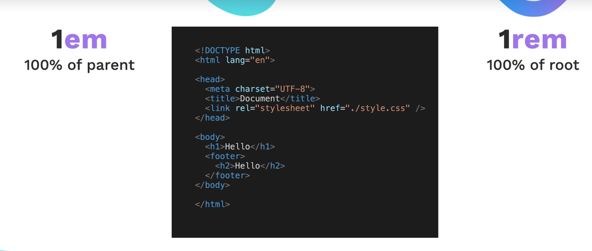


2:00


##### shortcut- grid-template

2:58

not recommended.


##### auto 

more responsive


##### auto row

auto row is different based on content.

Auto- diff for column & row meanings 


4:54


##### auto column

is responsive


#### demo

https://appbrewery.github.io/grid-sizing

play around. 

Fixed size and Auto size


#### Fractional sizing

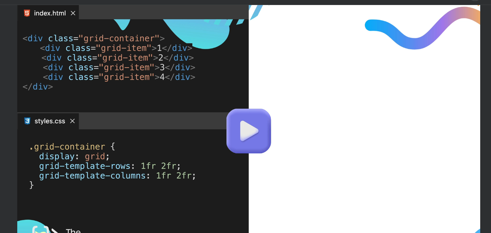


##### small personal exercises

7:10 - 

Do these & see .. change content & see 

GitHub\WebDevUdemy\Test\test61-1.html


8:21


#### minmax

9:16


Responsive between 400 & 800 


#### Repeat 


11:29


#### row/column declaration > actual divs


#### more divs

12:56


5 - will be based on content.


#### Grid auto row 

if more div declared then it will continue the grid properties on it.


This gives 300px to new rows.


#### Demo 2


https://appbrewery.github.io/grid-sizing


do the other ones - fractional, MinMax, Repeat.


change properties from inspect and play around - or watch this part just for revision.


#### Grid chip from inspect 

on the inspect on the .grid-container - next to it it will show "grid" when we click on that we can some things about grid.


##### layout tab


for me its below the elements tab.


#### Exercise

17:04


https://appbrewery.github.io/grid-sizing

go to test.


##### solution - mine

```
/* Write your CSS code below to make the purple items size, grow and shrink like the green ones.*/

.grid-container {
        display: grid;
        grid-template-rows: 1fr 1fr 2fr ;
        grid-template-columns: auto 400px minmax(200px,500px);
        gap: 0px;
        grid-auto-rows: 50px;
}
```


##### solution-hers


### 62. Grid Placement 


#### Grid normal


#### Grid cell


#### Multiple grid cells


#### Good initial grid summary of past lesson 


#### Good summary Grid


#### Height / Width

Height . If it’s not there takes content. But width default takes full html width


#### behavior stacking


#### 3 rem -

#### gap

Basically gap in grid means as dont need to rely on padding margin etc to create that gap 


#### Exercise1

6:42

GitHub\WebDevUdemy\10.2-GridPlacement\10.2 Grid Placement\exercise1.html

##### solution

3 lines:

      /* Solution */
      display: flex;
      align-items: center;
      justify-content: center;


```
<!DOCTYPE html>
<html lang="en">

<head>
  <meta charset="UTF-8">
  <meta name="viewport" content="width=device-width, initial-scale=1.0">
  <title>Grid Placement</title>
  <style>
    body {
      padding: 0;
      margin: 0;
    }

    .container {
      height: 100vh;
      display: grid;
      gap: 3rem;
      grid-template-columns: 1fr 1fr 1.5fr;
      grid-template-rows: 1fr 1fr;
    }

    .item {
      font-size: 5rem;
      color: white;
      font-family: Arial, Helvetica, sans-serif;
      background-color: blueviolet;
      
      /* Solution */
      display: flex;
      align-items: center;
      justify-content: center;
    }
  </style>
</head>

<body>
  <div class="container">
    <div class="item cowboy">🤠</div>
    <div class="item astronaut">👨‍🚀</div>
    <div class="item book">📖</div>
  </div>
</body>

</html>
```


flex box provides one of the easier way to center.


#### grid-column: span 2


GitHub\WebDevUdemy\10.2-GridPlacement\10.2 Grid Placement\demo1.html


#### shows line number in inspect


 


##### click on Triangle.


its actually 2 sub properties and this was shortcut.


#### grid-column-start / grid-column-end


#### line count from rightside - last line in Grid


#### 2 to -1

helpful if we have lot of columns. or they created programmatically or some other automatic way.


##### another example


##### example 2


#### grid-column breakdown

15:33


#### ex another

GitHub\WebDevUdemy\10.2-GridPlacement\10.2 Grid Placement\demo2.html

span 2 here on astronaut does not have space to occupy 2 spaces - thats because we had only 3 columns defined

grid-template-columns: 1fr 1fr 1.5fr;


#### order 1


#### direction


#### exercise 2 - 

18:32


##### solution:


```html
        .astronaut {
        .....
        /* TODO: Make the astronaut box look like the goal2 image. */
        /* grid-column: span 2; */
        /* or */
        grid-column-start: 1;
        grid-column-end: 3;
```


full code 

```html
<!DOCTYPE html>
<html lang="en">
  <head>
    <meta charset="UTF-8" />
    <meta name="viewport" content="width=device-width, initial-scale=1.0" />
    <title>Grid Placement</title>
    <style>
      body {
        padding: 0;
        margin: 0;
      }

      .container {
        height: 100vh;
        display: grid;
        gap: 3rem;
        grid-template-columns: 1fr 1fr 1.5fr;
        grid-template-rows: 1fr 1fr;
      }

      .item {
        font-size: 5rem;
        color: white;
        font-family: Arial, Helvetica, sans-serif;
        background-color: blueviolet;
        display: flex;
        align-items: center;
        justify-content: center;
      }

      .cowboy {
        background-color: #00b9ff;
        grid-column: span 2;
      }

      .astronaut {
        background-color: #03989e;
        order: 1;

        /* TODO: Make the astronaut box look like the goal2 image. */
        /* grid-column: span 2; */
        /* or */
        grid-column-start: 1;
        grid-column-end: 3;
      }
    </style>
  </head>

  <body>
    <div class="container">
      <div class="item cowboy">🤠</div>
      <div class="item astronaut">👨‍🚀</div>
      <div class="item book">📖</div>
    </div>
  </body>
</html>
```


##### solution2


#### shorthand


#### grid-area

but if 1 uses grid area - all others have to use grid area too.


#### exercise 3

##### solution

```html
      .book {
        background-color: #e58331;
        /* TODO: Make the book div look like 
      the goal3 image using grid-row. */
        grid-row-start: 1;
        grid-row-end: 3;
      }
```


##### Full code

```html
<!DOCTYPE html>
<html lang="en">
  <head>
    <meta charset="UTF-8" />
    <meta name="viewport" content="width=device-width, initial-scale=1.0" />
    <title>Grid Placement</title>
    <style>
      body {
        padding: 0;
        margin: 0;
      }

      .container {
        height: 100vh;
        display: grid;
        gap: 3rem;
        grid-template-columns: 1fr 1fr 1.5fr;
        grid-template-rows: 1fr 1fr;
      }

      .item {
        font-size: 5rem;
        color: white;
        font-family: Arial, Helvetica, sans-serif;
        background-color: blueviolet;
        display: flex;
        align-items: center;
        justify-content: center;
      }

      .cowboy {
        background-color: #00b9ff;
        grid-column: span 2;
      }

      .astronaut {
        background-color: #03989e;
        order: 1;
        grid-area: 2 / 1 / 3 / 3;
      }

      .book {
        background-color: #e58331;
        /* TODO: Make the book div look like 
      the goal3 image using grid-row. */
        grid-row-start: 1;
        grid-row-end: 3;
      }
    </style>
  </head>

  <body>
    <div class="container">
      <div class="item cowboy">🤠</div>
      <div class="item astronaut">👨‍🚀</div>
      <div class="item book">📖</div>
    </div>
  </body>
</html>

```


##### solution 2


##### solution 3


#### grid - can overlay

grid allows to overlay - so here orange is sitting on top of blue


#### exercise - grid-garden

https://appbrewery.github.io/gridgarden


##### level 1


##### level 2


##### level 3

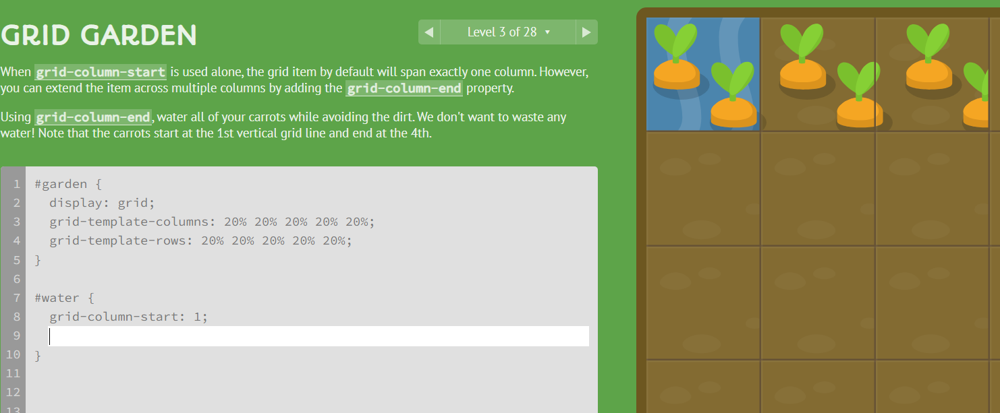


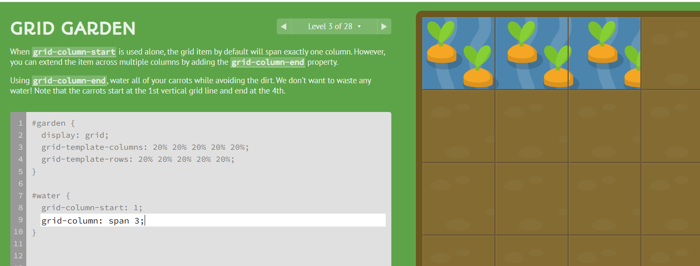


##### level 4


##### level 5


##### level 6


##### level 7


##### level 8


##### level 9


or - 

grid-column-start: span 3;

##### level 10


or

grid-column: 4 / 6;


##### level 11


or 

grid-column: 2 / span 3;


##### level 12


##### level 13


or - 

grid-row: 3 / span 3;


##### level 14


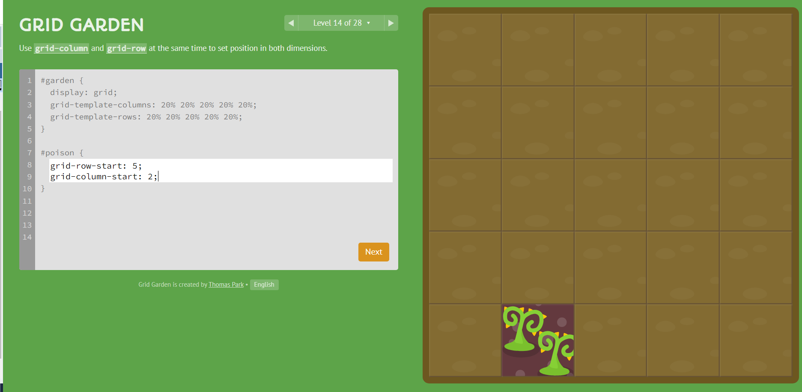


##### level 15


##### level 16


##### level 17


##### level 18


##### level 19


##### level 20


##### level 21


##### level 22


##### level 23

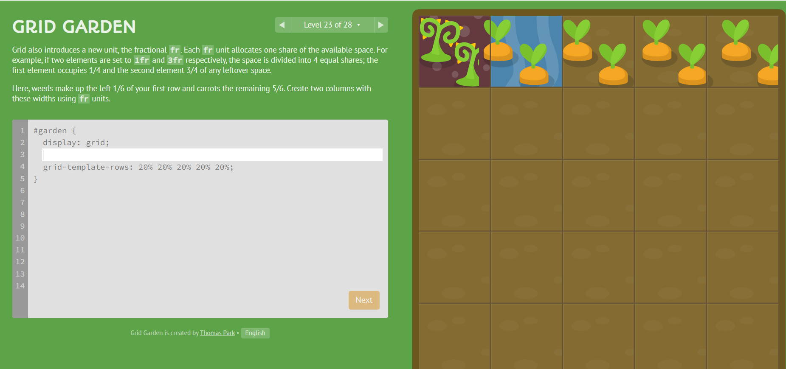


##### level 24


##### level 25


##### level 26


DID NOT ANSWER YET.


##### level 27


##### level 28


### 63. Project - Mondarian Painting


Dutch painter


$50.6 Million on auction


#### Solution 


##### Imp

body is flex ; that's a good trick that keeps the whole below stuff inside 1 container.


```html
<!DOCTYPE html>
<html lang="en">

<head>
  <meta charset="UTF-8">
  <meta name="viewport" content="width=device-width, initial-scale=1.0">
  <title>Mondrian Project</title>
  <style>
    /* 
    Write your CSS here 
    Line Colour: #000
    White: #F0F1EC
    Red: #E72F24
    Black: #232629
    Blue: #004592
    Yellow: #F9D01E
    */
    body {
      display: flex;
      justify-content: center;
      align-items: center;
      height: 100vh;
      margin: 0;
      padding: 0;
    }

    .container {
      height: 748px;
      width: 748px;
      display: grid;
      background-color: #000;
      grid-template-columns: 320px 198px 153px 50px;
      grid-template-rows: 414px 130px 155px 22px;
      gap: 9px;
    }

    .item {
      background-color: #F0F1EC;
    }

    .red {
      background-color: #E72F24;
    }

    .white1 {
      grid-column: span 3;
    }

    .white2 {
      grid-row: span 2;
    }

    .white3 {
      grid-area: 2 / 2 / 4 /4
    }

    .blue {
      background-color: #004592;
      border-bottom: 10px solid #000;
    }

    .white4 {
      grid-row: span 2;
    }

    .yellow {
      background-color: #F9D01E;
    }

    .black {
      background-color: #232629;
    }
  </style>
</head>

<body>
  <!-- Write your HTML here -->

  <div class="container">
    <div class="item red"></div>
    <div class="item white1"></div>
    <div class="item white2"></div>
    <div class="item white3"></div>

    <div class="item blue"></div>
    <div class="item white4"></div>

    <div class="item"></div>
    <div class="item yellow"></div>
    <div class="item black"></div>
  </div>
</body>

</html>
```


## Section 11 - Bootstrap


### 64. What is Bootstrap


To do the notes


### 65. Bootstrap Layout


To do the notes


### 66. Bootstrap Components


we can design - Cards buttons carousals, navs etc.

1:20


#### Components

https://getbootstrap.com/docs/5.3/getting-started/introduction/

https://getbootstrap.com/docs/5.3/components/buttons/


#### named buttons


from the Website 


##### button exercise 

3:06

real simple one using bootstrap


##### cards exercise

https://getbootstrap.com/docs/5.3/components/card/


copy card code


we already did earlier - 

```html
<!DOCTYPE html>
<html lang="en">
  <head>
    <meta charset="UTF-8" />
    <meta name="viewport" content="width=device-width, initial-scale=1.0" />
    <title>Bootstrap Components</title>
    <link
      href="https://cdn.jsdelivr.net/npm/bootstrap@5.3.0-alpha2/dist/css/bootstrap.min.css"
      rel="stylesheet"
      integrity="sha384-aFq/bzH65dt+w6FI2ooMVUpc+21e0SRygnTpmBvdBgSdnuTN7QbdgL+OapgHtvPp"
      crossorigin="anonymous"
    />
    <style></style>
  </head>

  <body>
    <!-- <button class="btn btn-success">Ok</button>    --- did for exercise button simple one-->

    <div class="card" style="width: 18rem">
      
      <div class="card-body">
        <h5 class="card-title">Card title</h5>
        <p class="card-text">
          Some quick example text to build on the card title and make up the
          bulk of the card's content.
        </p>
        <a href="#" class="btn btn-primary">Go somewhere</a>
      </div>
    </div>
  </body>
</html>
```


#### Navs component

3;47

https://getbootstrap.com/docs/5.3/components/navbar/

Bootstrap nav bars are best designed i see.

##### Brand at top left


##### image and text


another area for nav bars is from examples

##### examples-> Snippets -> Header

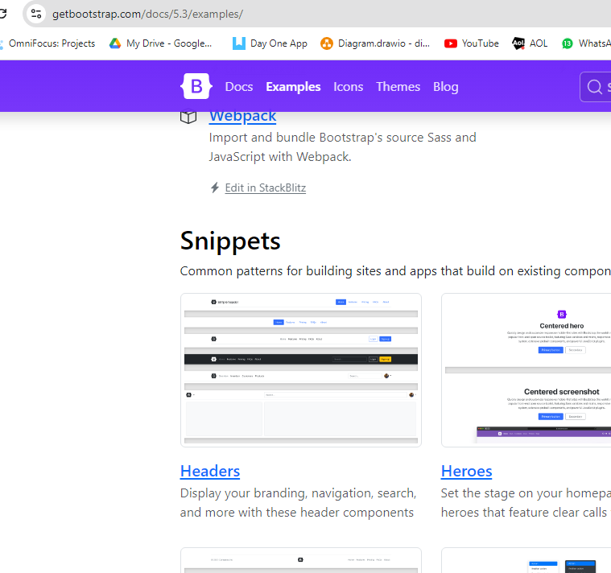


4:54 

we will build Move It website.

1 page multiple sections website.

we will show how easy it is to build with bootstrap.


5:38

#### Move it Website creation


GitHub\WebDevUdemy\11.2+Bootstrap+Components\11.2 Bootstrap Components\index.html


##### copy nav

and paste in body in html.

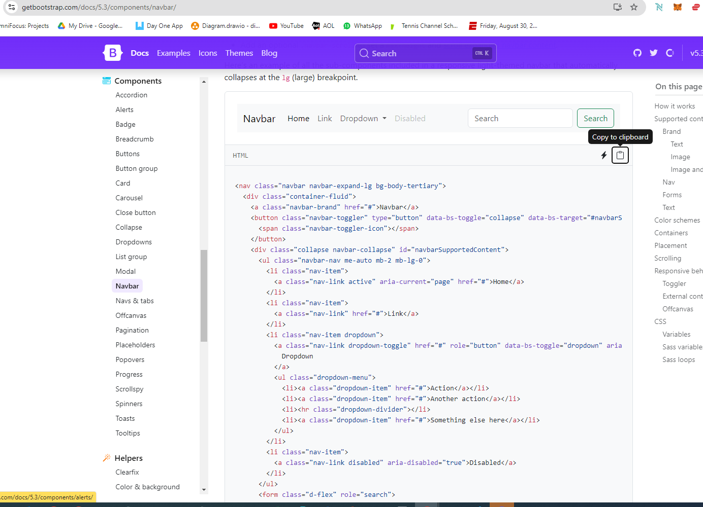

after i paste i have this. 


Below is when is reduce window width.

##### Hamburger Menu


but its right now does not show anything.

we have 2nd link.

6:16

##### Scripting link

gives access to bootstrap java script code.

need to put right at the end before body closing tag.


6:51


##### Disabled


but we will get rid of this since we dont need it.


now we change to the text we need.


8:18


##### Navbar Brand


have to change this to "Move It"


```html
    <nav class="navbar navbar-expand-lg bg-body-tertiary">
      <div class="container-fluid">
        <!-- <a class="navbar-brand" href="#">Navbar</a> -->
        <a class="navbar-brand" href="#">Move It</a>
```


##### image navbar Brand 

we can also have image for NavBar brand


although we dont use image. instead we will use SVG.


##### svg

https://icons.getbootstrap.com/

here you have all these icons as svg.

you can also search for them.

you can copy or download and use it.


```html
    <nav class="navbar navbar-expand-lg bg-body-tertiary">
      <div class="container-fluid">
        <!-- <a class="navbar-brand" href="#">Navbar</a> -->
        <a class="navbar-brand" href="#">
           Move
          It</a
        >
```


To do the notes till - 11:24


11:34 - showing how much code is behind the bootstrap. 


Examples is really good area to take lot of pieces. and put in your website.

taking from centered hero.

#### centered hero example & build

https://getbootstrap.com/docs/5.3/examples/heroes/


Similar to what we want.

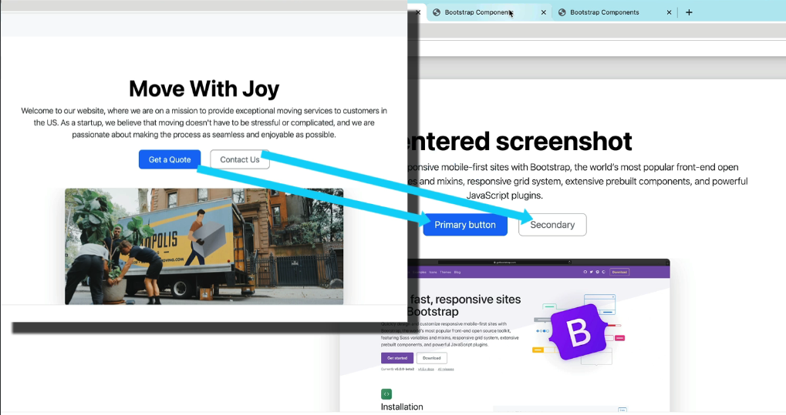


##### steps to copy

inspect & expand.


then hover your mouse over it so it highlights what we want.


then you copy that element.


copy just below our <nav> .


now our Move it site looks like below. 


we will fix the image.


we now put our moving-van.jpg instead.


 

then we put our own text now.


now we are done with your website!


now move on to next section.

##### Next section

14:17


###### Features section

https://getbootstrap.com/docs/5.3/examples/features/


lot of these bootstrap stuff comes from Appla. looks similar.

###### hover and copy


###### copy element from Inspect

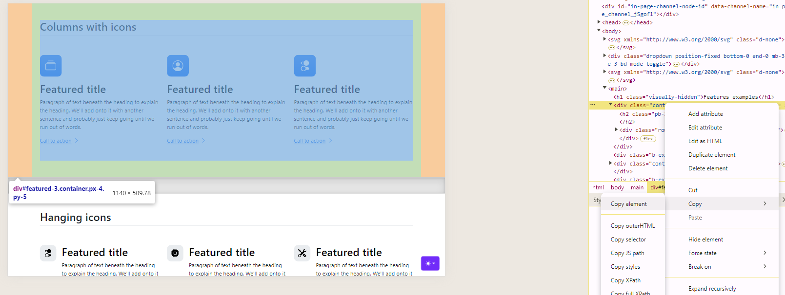


#### custom CSS

so when we copy the icons also don't look like the code we copied.


#### How do we know they added more to bootstrap

because all the default ones come from utilities.scss


but we have feature.css which is custom on top of bootstrap.

so that feature.css is custom file they created.


in this file below they added some custom features to make the icons looks a little diff.


so we need to copy that .feature-icon


17:00

now we get that squared more custom.

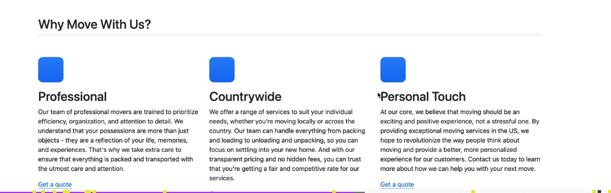


then next we do have svg part next.


#### svg 

can be installed many diff ways.

Download and put in your folder - like she did.

& access through IMG or SVg element.


alternatively you can copy HTML

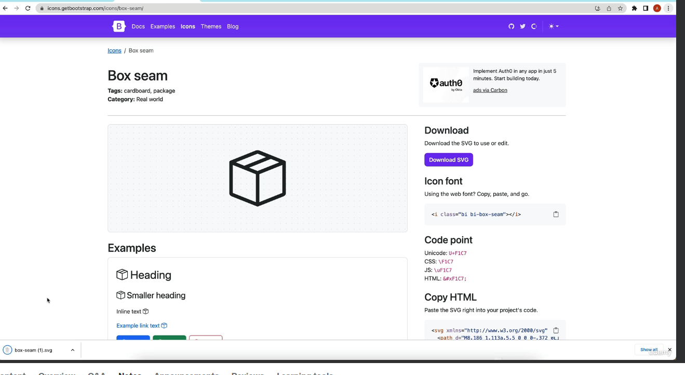

###### Change svg from examples

18:33


###### sizing the icon

height=30


19:21 - chevron right svg;


replace this - 


20:00

#### exercise Carousel


#### Exercises - Move it website 


## Install etc


### issue `code .`

`code .` does not work.


https://chat.openai.com/c/80b8284c-a90e-4914-b714-53ff4fb927a8

fixed when i comment out out Conda stuff.


```
..../Documents/GitHub
$ code .
node:internal/modules/cjs/loader:1132
  throw err;
  ^

Error: Cannot find module 'C:\Users\chuck.raghavan\AppData\Local\anaconda3\Library\c\Users\chuck.raghavan\AppData\Local\Programs\Microsoft VS Code\resources\app\out\cli.js'
    at Module._resolveFilename (node:internal/modules/cjs/loader:1129:15)
    at Module._load (node:internal/modules/cjs/loader:974:27)
    at f._load (node:electron/js2c/asar_bundle:2:13377)
    at Function.executeUserEntryPoint [as runMain] (node:internal/modules/run_main:96:12)
    at node:internal/main/run_main_module:23:47 {
  code: 'MODULE_NOT_FOUND',
  requireStack: []
}

Node.js v18.15.0


C:\Users\chuck.raghavan\AppData\Local\Programs\Microsoft VS Code\Code.exe .
```


### Moved to X64 VS Code

Installed x64 since VS code on LL laptop was x32.


```
....Documents/GitHub/WebDevUdemy (main)
$ code --version
1.83.1
a6606b6ca720bca780c2d3c9d4cc3966ff2eca12
ia32

.../Documents/GitHub/WebDevUdemy (main)
$ code --version
1.86.2
903b1e9d8990623e3d7da1df3d33db3e42d80eda
x64


```


