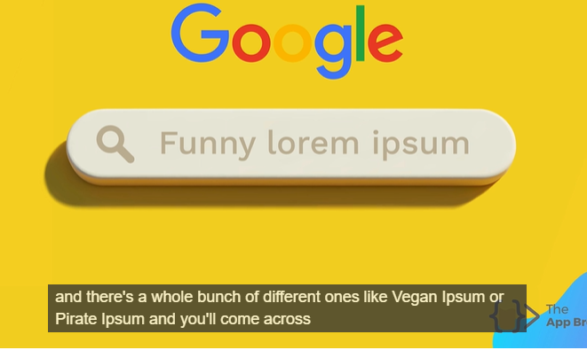
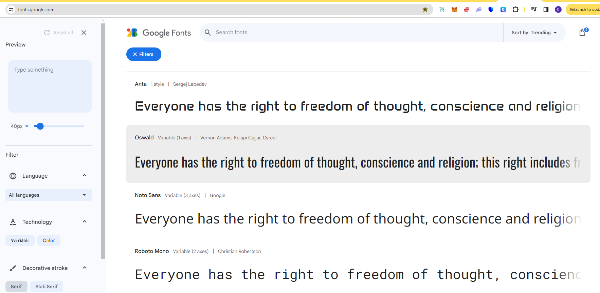

# WebDevUdemy
Web dev Udemy practice- study notes


## Section 1- Front-end Web development


1 - What you will get in this course

2-3-4 download & software install

Course syllabus in Section 1 folder - 2023+Web+Dev+Syllabus.pdf

12+Rules+to+Learn+to+Code+[2nd+Edition]+2022.pdf

Visual code Extensions

- Live preview 
- Prettier
- vscode-icons


### 5. How does Internet Actually work?

#### Submarine cables map

Under ocean cables 

https://www.submarinecablemap.com/

ISP , dns server , 

web server , client 


### 6. How does Websites Actually work?


3 types of files.


Prank your friends ! 

Play & change text ! 

Aria-label - 6:11 


#### Inspect 


### Done

my note to say i am done.


## Section 2- Introduction to HTML

​	

### 11. What is HTML

#### inventor of Web1

Sir Tim Berners-Lee - who created 1st website. inventor of internet.

#### Hypertext


Click 1 doc to 1 go to another - hyper links

#### Mark Up - 

Done through HTML tags

#### HTML tags

 


#### done


### 12. How to download course resources


### 13. The HTML Heading Elements 


#### Resources

2.1 Heading Element 

##### docs

https://developer.mozilla.org/en-US/docs/Web/HTML/Element/Heading_Elements

how to extract zip files from windows and mac.


https://developer.mozilla.org/en-US/docs/Web/HTML/Element/Heading_Elements


#### exercise

WebDevUdemy\2.1 Heading Element\index.html

#### Done


### 14. HTML Paragraph Elements


#### Exercise

WebDevUdemy\2.2 Paragraph Element\index.html


#### Lorem Ipsum

www.lipsum.com

Latin classical literature by famous author Cicero. 2000 yrs old. been in use in print indistry even since 1500s. when they did not have placeholder text they would put this.





#### done 


### 15. Self Closing Tags


#### Horizontal Rule element


#### Break element


#### Exercise 

WebDevUdemy\2.3 Void Elements\index.html

```html
<h1>William Blake</h1>

<p>
  17 south molton street <br \ />
  London<br \ />
  W1K 5QT<br \ />
  UK
</p>

<hr \ />

<p>
  William Blake (28 November 1757 – 12 August 1827) was an English poet,
  painter, and printmaker. Largely unrecognised during his life, Blake is now
  considered a seminal figure in the history of the poetry and visual art of the
  Romantic Age. What he called his "prophetic works" were said by 20th-century
  critic Northrop Frye to form "what is in proportion to its merits the least
  read body of poetry in the English language".[2] His visual artistry led
  21st-century critic Jonathan Jones to proclaim him "far and away the greatest
  artist Britain has ever produced".[3] In 2002, Blake was placed at number 38
  in the BBC's poll of the 100 Greatest Britons.[4] While he lived in London his
  entire life, except for three years spent in Felpham,[5] he produced a diverse
  and symbolically rich collection of works, which embraced the imagination as
  "the body of God"[6] or "human existence itself".[7]
</p>

<p>
  Although Blake was considered mad by contemporaries for his idiosyncratic
  views, he is held in high regard by later critics for his expressiveness and
  creativity, and for the philosophical and mystical undercurrents within his
  work. His paintings and poetry have been characterised as part of the Romantic
  movement and as "Pre-Romantic".[8] In fact, he has been said to be "a key
  early proponent of both Romanticism and Nationalism".[9] A committed Christian
  who was hostile to the Church of England (indeed, to almost all forms of
  organised religion), Blake was influenced by the ideals and ambitions of the
  French and American revolutions.[10][11] Though later he rejected many of
  these political beliefs, he maintained an amiable relationship with the
  political activist Thomas Paine; he was also influenced by thinkers such as
  Emanuel Swedenborg.[12] Despite these known influences, the singularity of
  Blake's work makes him difficult to classify. The 19th-century scholar William
  Michael Rossetti characterised him as a "glorious luminary",[13] and "a man
  not forestalled by predecessors, nor to be classed with contemporaries, nor to
  be replaced by known or readily surmisable successors".[14]
</p>

```


#### Difference Checker

https://www.diffchecker.com/

#### Done 


### 16. [Project] Movie Ranking


#### Exercise 

WebDevUdemy\2.4 Movie Ranking Project\index.html

```html
<!-- Write your code below -->
<h1>The Best Movies According to Chuck</h1>
<h2>My top 3 movies of all-time</h2>
<hr />

<h3>Jurassic Park</h3>
<p>
  love Speilberg's creativity here and its amazing to see something that could
  be as real as what's made in the movie if this were to have happened
</p>

<h3>The Matrix</h3>
<p>love the idea of us being in a Video game and movie is very well done</p>

<h3>Bourne Series</h3>
<p>
  I love this series as its very gripping and Matt Damon's character is very
  suitable
</p>
```


#### Done


### 17. How to Ace this Course


## Section 3- Intermediate HTML


### 18. The List Element


#### Unordered List


##### example - fbi top10

https://www.fbi.gov/wanted/topten


#### Exercise

WebDevUdemy\3.0 List Elements\index.html

```html
<h1>Angela's Cinnamon Roll Recipe</h1>

<h2>Ingredients</h2>

<h3>For the dough:</h3>
<ul>
  <li>¾ cup warm milk</li>
  <li>2 ¼ teaspoons yeast</li>
  <li>¼ cup granulated sugar</li>
  <li>1 egg plus 1 egg yolk</li>
  <li>¼ cup butter</li>
  <li>3 cups bread flour</li>
</ul>

<h3>For the filling:</h3>
<ul>
  <li>2/3 cup dark brown sugar</li>
  <li>1 ½ tablespoons ground cinnamon</li>
  <li>¼ cup butter</li>
</ul>

<h2>Instructions</h2>
<ol>
  <li>Mix the milk with the yeast, sugar, eggs.</li>
  <li>Melt the butter and add to the mixture.</li>
  <li>
    Add in the flour and mix until combined into a dough. Knead the dough for 10
    minuites.
  </li>
  <li>
    Transfer the dough into a large bowl and cover with plastic wrap. Leave it
    somewhere to rise for 2 hours.
  </li>
  <li>
    After the dough has doubled in size, roll it out into a large rectangle.
  </li>
  <li>Melt the butter for the filling and mix in the sugar and cinnamon.</li>
  <li>
    Spread the filling onto the dough then roll the dough into a swiss roll.
  </li>
  <li>Cut the roll into 3cm sections and place flat into a baking tray.</li>
  <li>
    Pre-heat the oven to 350F or 180C, then bake the rolls for 20-25min until
    lightly brown.
  </li>
</ol>
```


#### Done


### 19. Nesting and Indentation


### Nested lists


#### exercise

WebDevUdemy\3.1 Nesting and Indentation\index.html


```html
<!-- Write your code below -->
<ul>
  <li>A</li>
  <li>B</li>
  <ol>
    <li>B1</li>
    <li>B2</li>
    <ul>
      <li>B2a</li>
      <ul>
        <li>B2aa</li>
        <ki>B2ab</ki>
      </ul>
      <li>B2b</li>
      <li>B2c</li>
    </ul>
    <li>B3</li>
    <ol>
      <li>B31</li>
      <li>B32</li>
    </ol>
  </ol>
  <li>C</li>
</ul>
```


#### done


### 20. Anchor Elements


#### Anchor element

https://developer.mozilla.org/en-US/docs/Web/HTML/Element/a

##### href

Anchor element allows hyperlinks


##### syntax, multiple attributes


##### Global attributes

https://developer.mozilla.org/en-US/docs/Web/HTML/Global_attributes


##### draggable


#### Exercise 


Documents\GitHub\WebDevUdemy\3.2 Anchor Elements\index.html

```html
<h1>My top 5 Favourite Websites</h1>
<!-- Write your code below -->

<ol>
  <li><a href="https://www.udemy.com">Udemy - learn what you love</a></li>
  <li><a href="https://dayone.me/">Day One - great journalling tool</a></li>
  <li><a href="https://chat.openai.com/">ChatGpt</a></li>
  <li>
    <a href="https://plutonomicon.github.io/plutarch-plutus/README"
      >Cardano Blockchain - Plutarch</a
    >
  </li>
  <li>
    <a href="https://www.patreon.com/InvestAnswers/posts"
      >Crypto/Ai investment perpectives</a
    >
  </li>
</ol>

<p>Part 2 - start list from 5</p>
<ol start="5">
  <li><a href="https://www.udemy.com">Udemy - learn what you love</a></li>
  <li><a href="https://dayone.me/">Day One - great journalling tool</a></li>
  <li><a href="https://chat.openai.com/">ChatGpt</a></li>
  <li>
    <a href="https://plutonomicon.github.io/plutarch-plutus/README"
      >Cardano Blockchain - Plutarch</a
    >
  </li>
  <li>
    <a href="https://www.patreon.com/InvestAnswers/posts"
      >Crypto/Ai investment perpectives</a
    >
  </li>
</ol>
```


#### Done


### 21. Image Elements


#### img tag


#### alt attribute


#### SilkTide

SilkTide toolbar to listen to Alt reading attribute

Seems like its asking to login and also no free user email registration.


#### Exercise

Documents\GitHub\WebDevUdemy\3.3 Image Elements\index.html

```html
<h1>I am a Dog Person</h1>

<!-- Kitten image URL -->
<!-- https://raw.githubusercontent.com/appbrewery/webdev/main/kitten.jpeg
 -->

<!-- Puppy image URL -->


```


#### Done


### 22. [Project] Birthday Invite

#### Exercise - 

Documents\GitHub\WebDevUdemy\3.4 Birthday Invite Project\index.html

```html
<h1>It's My Birthday</h1>
<h2>On the 9th of December</h2>
<!-- Example image URL -->

<h3>What to bring:</h3>

<ul>
  <li>Lot of booze :)</li>
  <li>Chicken Biriyani</li>
  <li>Fun vibe</li>
</ul>

<h3>This is where you need to go:</h3>
<!-- Example Google Maps Link -->
<a
  href="https://www.google.com/maps/@35.7040744,139.5577317,3a,75y,289.6h,87.01t,0.72r/data=!3m6!1e1!3m4!1sgT28ssf0BB2LxZ63JNcL1w!2e0!7i13312!8i6656"
>
  Google Map</a
>

```


#### done


### 23. Tip from Angela - Habit building


### 24. Monthly App Brewery newsletter

signed up.


## Section 4 - Multi-Page Websites


### 25. Computer File Paths

Relative & absolute file paths

./ is current directory

#### Exercise

Documents\GitHub\WebDevUdemy\4.0 File Paths\Folder0\index.html


```html
<h1>All the Animals</h1>
<h2>Rabbit:</h2>

<h2>Cat:</h2>

<h2>Dog:</h2>

<h2>Fish:</h2>

<h2>Bird:</h2>


```


#### done


### 26. What are Webpages?


#### multi-page 


#### Exercise

Documents\GitHub\WebDevUdemy\4.1 WebPages\index.html

```html
<h1>Welcome to My Website!</h1>
<!-- Add an image of yourself that links to the about page -->
<a href="./public/about.html">
  
</a>
<hr />
<!-- Add a link to your contact me page here -->
<a href="./public/contact.html">Contact Me</a>
```


about.html

```html
<h1>About Me</h1>
<p>Lorem ipsum dolor sit amet, consectetur adipiscing elit. Pellentesque sem tellus, sagittis non odio nec, interdum
  elementum lacus. Ut ac justo eget risus sollicitudin fringilla sed ut leo. Ut condimentum elit nec fermentum lobortis.
  Quisque tincidunt quam nec tincidunt ullamcorper. Integer vitae pretium justo. In placerat volutpat pellentesque.
  Etiam
  gravida quam vitae odio pulvinar imperdiet. Vivamus venenatis gravida purus sit amet aliquet. Ut in nibh sed quam
  laoreet lacinia. Cras cursus ut dui vitae posuere. Vivamus volutpat urna vitae odio fringilla placerat. Nulla vel
  rhoncus sapien. Phasellus at interdum enim.</p>

<p>Curabitur elementum sagittis mollis. In porta nec quam ut semper. Nulla volutpat neque quis lacus mattis eleifend.
  Phasellus et congue odio. Mauris tristique, nisl quis porttitor porttitor, tortor ante mattis ex, at dictum tortor
  dolor
  ut sem. Nullam nec libero non ex porta vulputate a eu sapien. In nec bibendum mauris. Fusce iaculis lectus vel magna
  laoreet gravida.</p>

<p>Donec euismod vestibulum arcu, a blandit metus mattis ultrices. Integer quis hendrerit justo. Maecenas sed tempor mi.
  Fusce egestas urna leo. Mauris viverra sem sed libero egestas, volutpat aliquet magna porta. Quisque id diam sed ipsum
  interdum sollicitudin id quis augue. Donec congue nisl nec massa ornare imperdiet quis quis odio. Etiam ut volutpat
  nisl. Vestibulum hendrerit justo nibh, eget consequat magna fermentum finibus. Pellentesque et urna fringilla, rutrum
  neque in, varius leo. Vestibulum efficitur id massa eget pellentesque.</p>
```


contact.html

```html
<h1>Contact Me</h1>
<p>Tel: +123456789</p>
<p>Email: me@gmail.com</p>
<p>Address:</p>
<p>
  123 North Street<br />
  Some City<br />
  Some Country <br />
</p>
```


#### done


### 27. The HTML Boilerplate


#### !Doctype 

which version its written in 


#### html

root of the document - everything else goes within this.

has lang for language. more for screen readers.


#### head element

not displayed but important info but not content.

##### meta 

tag for character set.


##### title


##### Example - 

View Page source


##### Body element

All the content goes here.

Meat of the body.


#### ! Hit 

enter to get boilerplate


### 28. [Project] Portfolio Website


#### project

Documents\GitHub\WebDevUdemy\4.3 HTML Porfolio Project\index.html

```html
<!-- TODO 1: Create the HTML Boilerplate -->

<!-- TODO 2: Add Your previous projects' HTML into the public folder -->

<!-- TODO 3: Take screenshots of your project previews and add the images to the images folder -->

<!-- TODO 4: Add titles/subtitles etc. -->

<!-- TODO 5: Add a link to the project pages -->

<!-- TODO 6: Add images to show the project previews
HINT for TODO 6: You can use the height attribute set to 200 to make the image smaller:
https://developer.mozilla.org/en-US/docs/Web/HTML/Element/img#attr-height -->

<!-- TODO 7: Add the Contact Me and About Me page links -->
<!DOCTYPE html>
<html lang="en">
  <head>
    <meta charset="UTF-8" />
    <meta name="viewport" content="width=device-width, initial-scale=1.0" />
    <title>Chakravarti's Portfolio</title>
  </head>
  <body>
    <h1>Chakravarti Raghavan's Portfolio</h1>
    <h2>I am a Web3 Enthusiast</h2>
    <hr />
    <h3><a href="./public/MyMovieRanking.html">Movie Ranking Project</a></h3>
    
    <h3><a href="./public/MyBdayInvite.html">Birthday Invite Project</a></h3>
    
    <hr />
    <a href="./public/about.html">About Me </a>
    <a href="./public/contact.html"> Contact Me</a>
  </body>
</html>

```


MyMovieRanking.html

```html
<!-- Write your code below -->
<h1>The Best Movies According to Chuck</h1>
<h2>My top 3 movies of all-time</h2>
<hr />

<h3>Jurassic Park</h3>
<p>
  love Speilberg's creativity here and its amazing to see something that could
  be as real as what's made in the movie if this were to have happened
</p>

<h3>The Matrix</h3>
<p>love the idea of us being in a Video game and movie is very well done</p>

<h3>Bourne Series</h3>
<p>
  I love this series as its very gripping and Matt Damon's character is very
  suitable
</p>
```


MyBdayInvite.html

```html
<h1>It's My Birthday</h1>
<h2>On the 9th of December</h2>
<!-- Example image URL -->

<h3>What to bring:</h3>

<ul>
  <li>Lot of booze :)</li>
  <li>Chicken Biriyani</li>
  <li>Fun vibe</li>
</ul>

<h3>This is where you need to go:</h3>
<!-- Example Google Maps Link -->
<a
  href="https://www.google.com/maps/@35.7040744,139.5577317,3a,75y,289.6h,87.01t,0.72r/data=!3m6!1e1!3m4!1sgT28ssf0BB2LxZ63JNcL1w!2e0!7i13312!8i6656"
>
  Google Map</a
>

```


about.html

```html
<h1>About Me</h1>
<p>Web3 developer, Blockchain technologies, Crypto, Cardano, Plutus, Plutarch, Lucid Offchain.</p>

<p>
  <ul>
<li>Writing Smart contracts on Cardano Blockchain using Plutus apps, Plutarch and offchain using Lucid</li>
<li>Experience in Python Web3, Smart contracts Solidity with Remix, deploying NFT smart contract with Streamlit UI. </li>
<li>Understanding of Blockchains, BIP-39, 44 etc standards, mnemonic phrases, private keys, hash, SHA-256, cryptography, digital wallets, Digital signature, how encryption works. </li>
<li>Worked with Geth, Ganache, Metamask wallets, Kovan testnets, Faucets.</li>
<li>Worked with Python Web3 to interact with Smart contract, send transactions, gas estimates, Bit transactions, mint NFTs, approve, transfer tokens through python. </li>
<li>Used OpenZepplin Libraries.</li>
<li>Worked with Infura API using Python to connect to Kovan Testnet. </li>
<li>Interacted with etherscan through Python to get stats.</li>
<li>Worked with Chainlink Oracles data feeds.</li>
<li>Worked with Piñata IPFS to store NFT pics and get the IPFS numbers to mint. </li>
<li>Generated AI pics for NFT from pre-trained models of Style Transfer. </li>
</ul>
</p>

<p>check some of my projects @
  <a href="https://github.com/rchak007"> My Github - https://github.com/rchak007</a> </p>
```


contact.html

```html
<h1>Contact Me</h1>
<p>Tel: +123456789</p>
<p>Email: me@gmail.com</p>
<p>Address:</p>
<p>
  123 North Street<br />
  Some City<br />
  Some Country <br />
</p>
```


https://rchak007.github.io/html-portfolio/

#### done


### 29. How to Host Your Website for Free with GitHub

https://rchak007.github.io/html-portfolio/

created this website on GitHub.

Documents\GitHub\WebDevUdemy\4.3 HTML Porfolio Project\index.html


### 30. Introduction to Capstone Projects


### 31. Instructions to Capstone Project 1

https://www.udemy.com/course/the-complete-web-development-bootcamp/learn/lecture/37330378#notes


Documents\GitHub\WebDevUdemy\Capstone Project 1\index.html

```html
<!DOCTYPE html>
<html lang="en">
  <head>
    <meta charset="UTF-8" />
    <meta name="viewport" content="width=device-width, initial-scale=1.0" />
    <title>My Resume</title>
  </head>
  <body>
    <h1>Chakravarti Raghavan</h1>
    
    <h2>Summary</h2>
    <p>I am a Web3 Enthusiast</p>
    <hr />
    <h2>Education</h2>
    <ul>
      <li>
        <a
          href="https://www.linkedin.com/school/missouri-university-of-science-and-technology/"
        >
          Missouri University of Science and Technology</a
        >
        Masters in Computer Science 1993-97
      </li>
      <li>
        <a href="https://www.jntuh.ac.in/">
          Jawaharlal Nehru Technological University</a
        >
        Bachelors in Computer Science 1989-93
      </li>
    </ul>
    <hr />
    <h2>Featured Projects</h2>
    <a href="https://github.com/rchak007/decentralSeedRecover">
      Decentralized Seed Phrase Recovery using Cardano Blockchain</a
    >
    <br />
    <br />
    
    <br />
    <br />
    <a href="https://github.com/rchak007/PlutarchCrowdFunding">
      CrowdFunding in Cardano Blockchain using Plutarch</a
    >
    <br />
    <br />
    

    <br />
    <br />
    <a href="https://github.com/rchak007/governmentDaoICP">
      Government DAO in Internet Computer blockchain</a
    >
    <br />
    <br />
    
    <br />
    <h2>Skills</h2>
    <ul>
      <li>Plutus/Plutarch/Lucid for Cardano</li>
      <li>Solidity for Ethereum</li>
      <li>Motoko for ICP</li>
      <li>Python Web3</li>
      <li>Typescript Web3</li>
      <li>Haskell</li>
    </ul>
    <h2>Other</h2>
    <ul>
      <li><a href="./public/hobbies.html">My Hobbies</a></li>
      <li><a href="./public/contacts.html">Contact Me</a></li>
    </ul>
  </body>
</html>
```


hobbies.html

```html
<h1>My Hobbies</h1>
<ol>
  <li>Hot yoga</li>
  <li>Salsa dancing</li>
  <li>Financial investing/Trading in Stocks and Crypto</li>
</ol>
```


contacts.html

```html
<h1>My Contact Details</h1>
<br />
<p>Los Angeles</p>
<p>Phone: 123456789</p>
<p>Email: rchak1@aol.com</p>
```


https://rchak007.github.io/onlineResume/


#### done


## Section 5 - Introduction to CSS


### 32. Why do we need CSS?


#### Marc Andreessen - mosaic inventor and Netscape

https://en.wikipedia.org/wiki/Marc_Andreessen

**Marc Lowell Andreessen** (born July 9, 1971) is an American businessman and [software engineer](https://en.wikipedia.org/wiki/Software_engineer). He is the co-author of [Mosaic](https://en.wikipedia.org/wiki/Mosaic_(web_browser)), the first widely used [web browser](https://en.wikipedia.org/wiki/Web_browser) with a graphical user interface; co-founder of [Netscape](https://en.wikipedia.org/wiki/Netscape); and co-founder and general partner of [Silicon Valley](https://en.wikipedia.org/wiki/Silicon_Valley) venture capital firm [Andreessen Horowitz](https://en.wikipedia.org/wiki/Andreessen_Horowitz). He co-founded and later sold the [software company](https://en.wikipedia.org/wiki/Software_company) [Opsware](https://en.wikipedia.org/wiki/Opsware) to [Hewlett-Packard](https://en.wikipedia.org/wiki/Hewlett-Packard). Andreessen is also a co-founder of [Ning](https://en.wikipedia.org/wiki/Ning_(website)), a company that provides a platform for social networking websites and an inductee in the [World Wide Web Hall of Fame](https://en.wikipedia.org/wiki/World_Wide_Web_Hall_of_Fame). Andreessen's net-worth is estimated at $1.7 billion.


#### CSS creator - Håkon Wium Lie

https://en.wikipedia.org/wiki/H%C3%A5kon_Wium_Lie

**Håkon Wium Lie** (born July 26, 1965) is a [Norwegian](https://en.wikipedia.org/wiki/Norwegians) web pioneer, a standards activist, and the chairman of YesLogic, developers of [Prince](https://en.wikipedia.org/wiki/Prince_(software)) CSS-based PDF rendering software.[[1\]](https://en.wikipedia.org/wiki/Håkon_Wium_Lie#cite_note-howcome-1)[[2\]](https://en.wikipedia.org/wiki/Håkon_Wium_Lie#cite_note-liehome-2) He is best known for developing [Cascading Style Sheets](https://en.wikipedia.org/wiki/CSS) (CSS) while working with [Tim Berners-Lee](https://en.wikipedia.org/wiki/Tim_Berners-Lee) and [Robert Cailliau](https://en.wikipedia.org/wiki/Robert_Cailliau) at [CERN](https://en.wikipedia.org/wiki/CERN) in 1994. He was the [Chief Technology Officer](https://en.wikipedia.org/wiki/Chief_Technology_Officer) of [Opera Software](https://en.wikipedia.org/wiki/Opera_(company)) from 1998 until the browser was sold to new owners in 2016.[[3\]](https://en.wikipedia.org/wiki/Håkon_Wium_Lie#cite_note-3)[[2\]](https://en.wikipedia.org/wiki/Håkon_Wium_Lie#cite_note-liehome-2)


#### her Website

just shows HTML vs what happens when adding CSS to it as is.

https://appbrewery.github.io/just-add-css/


### 33. How to add CSS


#### 3 types


#### Inline 


Global attribute style- available to all tags.


#### Internal


Inline add only when its very specific and not to use everywhere.

instead Internal is better.


##### selector


#### External

Most common


#### Summary 


#### Exercise

Documents\GitHub\WebDevUdemy\5.1. Adding CSS\index.html

```html
<!DOCTYPE html>
<html lang="en">
  <head>
    <meta charset="UTF-8" />
    <title>Adding CSS</title>
  </head>

  <body>
    <h1>Three Methods of Adding CSS</h1>
    <!-- Create 3 Links to The 3 Webpages: inline, internal and external -->
    <a href="./inline.html">Inline CSS page</a> <br />
    <a href="./internal.html">Internal CSS page</a> <br />
    <a href="./external.html">External CSS pages</a>
  </body>
</html>
```


inline.html

```html
<!DOCTYPE html>
<html lang="en">
  <head>
    <meta charset="UTF-8" />
    <title>Inline</title>
  </head>

  <body>
    <h1 style="color: blue">Style Me in Blue!</h1>
  </body>
</html>
```


internal.html

```html
<!DOCTYPE html>
<html lang="en">
  <head>
    <meta charset="UTF-8" />
    <title>Internal</title>
    <style>
      h1 {
        color: red;
      }
    </style>
  </head>

  <body>
    <h1>Style Me in Red!</h1>
  </body>
</html>

```


external.html

```html
<!DOCTYPE html>
<html lang="en">
  <head>
    <meta charset="UTF-8" />
    <title>External</title>
    <link rel="stylesheet" href="./style.css" />
  </head>
  <body>
    <h1>Style Me in Green</h1>
  </body>
</html>
```


style.css

```css
h1 {
  color: green;
}

```


#### done


### 34. CSS Selectors


#### Element Selector


#### Class Selector


#### ID selector


#### Attribute Selector


https://developer.mozilla.org/en-US/docs/Web/HTML/Element/li


#### Exercise

Documents\GitHub\WebDevUdemy\5.3 CSS Selectors\index.html

```html
<!DOCTYPE html>
<html lang="en">

<head>
  <meta charset="UTF-8">
  <title>CSS Selectors</title>
  <link rel="stylesheet" href="./style.css" />
</head>

<body>
  <h1>CSS Selectors</h1>
  <h2>Applying CSS to Different Parts of HTML</h2>
  <!-- TODO 1: Set the CSS for all paragraph tags to "color: red" -->
  <p class="note">1. The element selector targets elements based on their HTML tag name.</p>

  <ol>
    <!-- TODO 2: Set the CSS for all elements with a class of "note" to "font-size: 20px" -->
    <li class="note" value="2">Class selectors target elements based on the value of the class attribute.</li>

    <!-- TODO 3: Set the CSS for the element with an id of "id-selector-demo" to "color: green" -->
    <li class="note" id="id-selector-demo" value="3">ID selectors target elements based on the value of the id
      attribute.</li>

    <!-- TODO 4: Set the CSS for the li elements that have the "value" attribute set to "4" to have "color: blue" -->
    <li class="note" value="4">Attribute selectors target elements based on their attributes and values.</li>

    <!-- TODO 5: Set all elements to have "text-align: center" -->
    <li class="note" value="5">The universal selector targets all elements.</li>
  </ol>
</body>

</html>
```


```css
ol {
  margin-left: -40px;
  margin-top: -20px;
  list-style-position: inside;
}

/* Write your CSS below, don't change the rules above. */
p {
  color: red;
}
.note {
  font-size: 20px;
}
#id-selector-demo {
  color: green;
}
li[value="4"] {
  color: blue;
}
html {
  text-align: center;
}
```


#### Done


###  35. [Project] Color Vocab Website


#### project

Documents\GitHub\WebDevUdemy\5.4 ColorVocabProject\index.html

```html
<!DOCTYPE html>
<html lang="en">
  <head>
    <meta charset="UTF-8" />
    <title>Spanish Vocabulary</title>
    <link rel="stylesheet" href="./style.css" />
  </head>

  <body>
    <h1>Colors</h1>
    <h2>Learn the colors in Spanish!</h2>
    <h2 class="color-title" id="red">Rojo</h2>
    

    <h2 class="color-title" id="blue">Azul</h2>
    

    <h2 class="color-title" id="orange">Anaranjado</h2>
    

    <h2 class="color-title" id="green">Verde</h2>
    

    <h2 class="color-title" id="yellow">Amarillo</h2>
    
  </body>
</html>

<!-- 
TODOs
IMPORTANT: You should not need to make ANY CHANGES to index.html
All code should be written in your CSS file.

1. Create a CSS file and incorporate it as an external stylesheet.
2. Use CSS to style each of the color titles to meaning. 
Hint: Use the id to help if you don't know the words in spanish.
3. Use CSS to change all the color titles to have "font-weight: normal;"
4. Use CSS (not HTML) to make all the images 200px heigh and 200px wide. 
Hint: 
https://developer.mozilla.org/en-US/docs/Web/CSS/height
https://developer.mozilla.org/en-US/docs/Web/CSS/width
-->

```

```css
#red {
  color: red;
}
#blue {
  color: blue;
}
#orange {
  color: orange;
}
#green {
  color: green;
}
#yellow {
  color: yellow;
}
.color-title {
  font-weight: normal;
}
img {
  height: 200px;
  width: 200px;
}
```


#### done


### 36. Tip from Angela


### 37. Join the Student community

report issue.

https://docs.google.com/forms/d/e/1FAIpQLSeZewm5WSjfb_VfOdkQCQpdunWl9FeIQlVhdYjSYK5fvM_fcw/viewform


## Section 6 - CSS Properties


### 38. CSS Colors


#### Named colors documentation

https://developer.mozilla.org/en-US/docs/Web/css/named-color


#### Important - color hunt	

https://colorhunt.co/


3rd one can be background. 1st one H1 and 2nd one h2.

#### Hex codes


#### RGB Mixer

https://www.csfieldguide.org.nz/en/interactives/rgb-mixer/


#### Exercise 

Documents\GitHub\WebDevUdemy\6.0 CSS Colors\index.html

```html
<!DOCTYPE html>
<html lang="en">
  <head>
    <meta charset="UTF-8" />
    <title>Colors</title>
    <style>
      /* Write your CSS code here. */
      /* 1. Make the background of the webpage "antiquewhite"
    2. Make the h1 "whitesmoke"
    3. Make the background of the h1 "darkseagreen"
    4. Make the h2 #FAF8F1
    5. Make the background of the h2 "#C58940" */
      body {
        background-color: antiquewhite;
      }
      h1 {
        color: whitesmoke;
        background-color: darkseagreen;
      }
      h2 {
        color: #faf8f1;
        background-color: #c58940;
      }
    </style>
  </head>

  <body>
    <h1>Hello</h1>
    <h2>World</h2>
  </body>
</html>

```


#### done


### 39. Font Properties


#### Font Size


#### Pixel vs Point


#### MS Word - points

Word uses Points 


#### 1em 1rem


​	

Recommend only REM & not EM


#### Font Size task

just play around to see how `em` and `rem` affects etc.

Documents\GitHub\WebDevUdemy\6.1 Font properties\font-size.html


```html
<!DOCTYPE html>
<html lang="en">
  <head>
    <meta charset="UTF-8" />
    <title>Font-Size</title>
    <style>
      #pixel {
        font-size: 20px;
      }

      #point {
        font-size: 20pt;
      }

      #em {
        font-size: 1em;
      }

      #rem {
        font-size: 1rem;
      }

      footer {
        font-size: 12pt;
      }

      html {
        font-size: xx-large;
      }
    </style>
  </head>

  <body>
    <p id="pixel">1 Pixel is 1/96 of an Inch</p>
    <p id="point">1 Point is 1/72 of an Inch</p>
    <footer>
      <p id="em">1em is 100% the size of the parent element</p>
      <p id="rem">1rem is 100% the size of the root element</p>
    </footer>
  </body>
</html>
```


#### font Weight

normal or bold


#### font-family


#### backup generic font family

Helvetica is mac typeface. So it may not be there on all computers so we have generic backup.

Sans serif - has edges at right angle on the bottom and edges.

if it has feet or decorations at edges its serif type.


put in double quotes if font family has space.


#### Custom font


##### Fonts.google.com


Choose whatever fonts you want.

and when you click on the Oswald for example it inside can show different Font Weights. Sometimes you can choose by font weight or here it chose all those as a whole on its own.





then go to the ICON on right top - View Selected Families.

Shows the couple i selected.

Then click on `Embed code1`


##### Embed Code and CSS

Then copy the the code.

This will go in `<link>` element inside the `<head>` ususally.

then the CSS can go into your styling and use those classes if need be.


##### task to do for custom font


Documents\GitHub\WebDevUdemy\6.1 Font properties\font-family.html

```html
<!DOCTYPE html>
<html lang="en">
  <head>
    <meta charset="UTF-8" />
    <title>Font Family</title>
    <style>
      .merriweather-light {
        font-family: "Merriweather", serif;
        font-weight: 300;
        font-style: normal;
      }

      .merriweather-regular {
        font-family: "Merriweather", serif;
        font-weight: 400;
        font-style: normal;
      }

      .merriweather-bold {
        font-family: "Merriweather", serif;
        font-weight: 700;
        font-style: normal;
      }

      .merriweather-black {
        font-family: "Merriweather", serif;
        font-weight: 900;
        font-style: normal;
      }

      .merriweather-light-italic {
        font-family: "Merriweather", serif;
        font-weight: 300;
        font-style: italic;
      }

      .merriweather-regular-italic {
        font-family: "Merriweather", serif;
        font-weight: 400;
        font-style: italic;
      }

      .merriweather-bold-italic {
        font-family: "Merriweather", serif;
        font-weight: 700;
        font-style: italic;
      }

      .merriweather-black-italic {
        font-family: "Merriweather", serif;
        font-weight: 900;
        font-style: italic;
      }
      /* // <uniquifier>: Use a unique and descriptive class name */
      /* // <weight>: Use a value from 200 to 700 */
      .oswald-example {
        font-family: "Oswald", serif;
        font-optical-sizing: auto;
        font-weight: 200;
        font-style: normal;
      }

      #helvetica {
        font-family: Helvetica, sans-serif;
      }

      #arial {
        font-family: Arial, sans-serif;
      }

      #serif {
        font-family: serif;
      }

      #sans-serif {
        font-family: sans-serif;
      }

      #cursive {
        font-family: cursive;
      }

      #monospace {
        font-family: monospace;
      }

      #fantasy {
        font-family: fantasy;
      }
    </style>
    <link rel="preconnect" href="https://fonts.googleapis.com" />
    <link rel="preconnect" href="https://fonts.gstatic.com" crossorigin />
    <link
      href="https://fonts.googleapis.com/css2?family=Merriweather:ital,wght@0,300;0,400;0,700;0,900;1,300;1,400;1,700;1,900&family=Oswald:wght@200..700&display=swap"
      rel="stylesheet"
    />
  </head>

  <body>
    <h1 class="oswald-example">Font family size</h1>
    <h2>heading 2 Font family size</h2>
    <h2 class="oswald-example">heading 2 Font family size</h2>
    <h2 class="merriweather-black-italic">heading 2 Font family size</h2>
    <p id="helvetica">Helvetica</p>
    <p id="arial">Arial</p>
    <p id="serif">Serif</p>
    <p id="sans-serif">Sans Serif</p>
    <p id="cursive">Cursive</p>
    <p id="monospace">Monospace</p>
    <p id="fantasy">Fantasy</p>
  </body>
</html>
```


#### text-align


#### Exercise

Documents\GitHub\WebDevUdemy\6.1 Font properties\index.html


```html
<!DOCTYPE html>
<html lang="en">
  <head>
    <meta charset="UTF-8" />
    <title>CSS Properties</title>
    <style>
      html {
        font-size: 30px;
      }
      body {
        background-color: cornflowerblue;
        color: white;
        font-size: 18px;
      }

      /* Don't change the CSS above, add Your CSS below */
      .coral {
        color: coral;
      }
      #fontSize {
        font-size: 2rem;
      }
      #fontWeight {
        font-weight: 900;
      }

      /* <uniquifier>: Use a unique and descriptive class name */
      /* <weight>: Use a value from 400 to 700 */

      .caveat-1 {
        font-family: "Caveat", cursive;
        font-optical-sizing: auto;
        font-weight: 400;
        font-style: normal;
      }
      #textAlign {
        text-align: right;
      }
    </style>
    <link rel="preconnect" href="https://fonts.googleapis.com" />
    <link rel="preconnect" href="https://fonts.gstatic.com" crossorigin />
    <link
      href="https://fonts.googleapis.com/css2?family=Caveat:wght@400..700&display=swap"
      rel="stylesheet"
    />
  </head>

  <body>
    <h1>Important CSS Properties</h1>
    <p class="coral">Color</p>
    <p id="fontSize">Font Size</p>
    <p id="fontWeight">Font Weight</p>
    <p class="caveat-1">Font Family</p>
    <p id="textAlign">Text Align</p>

    <!-- TODOs
  1. Change the color of <p>Color</p> to "coral" color.
  2. Change the font size of <p>Font Size</p> to 2X the size of the root font size.
  3. Change the font weight of <p>Font Weight</p> to 900.
  4. Change the font family of <p>Font Family</p> to the Google font Caveat with regular (400) font weight.
  Link: https://fonts.google.com/specimen/Caveat
  5. Change the <p>Text Align</p> to right align.
  6. Change the the root (html element) font size to 30px -->
  </body>
</html>
```


#### Done


```
git config --global user.email "rchak1@aol.com"

```


## Install etc


### issue `code .`

`code .` does not work.


https://chat.openai.com/c/80b8284c-a90e-4914-b714-53ff4fb927a8

fixed when i comment out out Conda stuff.


```
..../Documents/GitHub
$ code .
node:internal/modules/cjs/loader:1132
  throw err;
  ^

Error: Cannot find module 'C:\Users\chuck.raghavan\AppData\Local\anaconda3\Library\c\Users\chuck.raghavan\AppData\Local\Programs\Microsoft VS Code\resources\app\out\cli.js'
    at Module._resolveFilename (node:internal/modules/cjs/loader:1129:15)
    at Module._load (node:internal/modules/cjs/loader:974:27)
    at f._load (node:electron/js2c/asar_bundle:2:13377)
    at Function.executeUserEntryPoint [as runMain] (node:internal/modules/run_main:96:12)
    at node:internal/main/run_main_module:23:47 {
  code: 'MODULE_NOT_FOUND',
  requireStack: []
}

Node.js v18.15.0


C:\Users\chuck.raghavan\AppData\Local\Programs\Microsoft VS Code\Code.exe .
```


### Moved to X64 VS Code

Installed x64 since VS code on LL laptop was x32.


```
....Documents/GitHub/WebDevUdemy (main)
$ code --version
1.83.1
a6606b6ca720bca780c2d3c9d4cc3966ff2eca12
ia32

.../Documents/GitHub/WebDevUdemy (main)
$ code --version
1.86.2
903b1e9d8990623e3d7da1df3d33db3e42d80eda
x64


```


